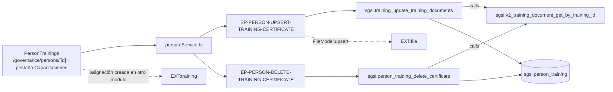

# Registrar certificados de capacitación de una persona

## Propósito
Dejar evidencia de que una persona completó una capacitación asignada: adjuntar el certificado y registrar asistencia, porcentaje de aprobación, estado y fecha de completitud.

## Entrada desde UI
Pestaña **Capacitaciones** dentro de `/governance/persons/[id]`, renderizada por `PersonTrainings` (`person-details.tsx:814`).

## Flujo funcional
1. `PersonTrainings` lista las capacitaciones ya asignadas a la persona, que vienen embebidas en el payload de `EP-PERSON-GET-BY-ID`. **No existe aquí una acción para asignar una capacitación nueva**: eso pertenece al módulo Capacitaciones.
2. **Adjuntar certificado**: seleccionar un archivo abre un diálogo que pide el nombre; al confirmar se arma un `FormData` con el archivo y los campos de resultado, y se llama `upsertTrainingCertificate(personTrainingId, formData)` → `EP-PERSON-UPSERT-TRAINING-CERTIFICATE`.
3. El controller valida el schema, ejecuta la función SQL y registra el archivo en el índice compartido (`FileModel.upsert`, `entity_type='training-certificate'`).
4. **Eliminar certificado**: `deleteTrainingCertificate(documentId)` → `EP-PERSON-DELETE-TRAINING-CERTIFICATE`. El modelo primero resuelve la ruta del archivo con `sgsi.person_training_get_certificate_path`, lo borra del disco validando el nombre, y recién después limpia las columnas de la fila.

## Frontend
`PersonDetails` → `PersonTrainings` → `usePerson()` → `personStore` → `person.Service.ts`.

## API
- `POST /person/upsertTrainingCertificate/:personTrainingId` → `EP-PERSON-UPSERT-TRAINING-CERTIFICATE` (`verifyAdminOnly`)
- `POST /person/deleteTrainingCertificate/:documentId` → `EP-PERSON-DELETE-TRAINING-CERTIFICATE` (`verifyAdminOnly`)

## Backend
`routers/person.ts:34-44` → `controllers/person.ts#upsertTrainingCertificate|deleteTrainingCertificate` → `models/person.ts` → `queries/person.ts`.
El borrado valida el tenant con `sgsi.person_training_get_customer_id` (`FN-PERSON-TRAINING-GET-CUSTOMER-ID`); la subida **no**.

## Database
`sgsi.training_update_training_documents` (`funciones_sgsi.sql:9330-9402`) y `sgsi.person_training_delete_certificate` (`:6949-6991`), ambas devolviendo el estado actualizado vía `sgsi.v2_training_document_get_by_training_id`. Helper de ruta: `sgsi.person_training_get_certificate_path`. Tabla: `sgsi.person_training` (WRITE).

## Reglas relevantes
- **Ninguna de las dos funciones crea ni borra la asignación**: solo escriben (o limpian) las columnas de certificado y resultado de una fila `person_training` que ya existe.
- `training_update_training_documents` recibe arrays paralelos aunque el controller envía siempre un único certificado.
- El borrado del archivo físico ocurre en Node antes de tocar la fila, con validación del nombre para evitar rutas maliciosas.

## Consideraciones
- **Deslinde de dominio**: la UI vive en Gobierno y los endpoints son del router `/person` (de Gobierno), por eso la Operación se documenta aquí — mismo criterio de responsabilidad funcional aplicado en el resto de los módulos. Pero la **propiedad de la entidad** `sgsi.person_training` es de Capacitaciones, y así queda declarado como dependencia externa `training`.
- **Seguridad (tenant isolation, no corregido)**: `EP-PERSON-UPSERT-TRAINING-CERTIFICATE` no valida que `personTrainingId` pertenezca al cliente autenticado, **pese a que el helper necesario existe** (`_getTrainingCustomerId` en `queries/person.ts:47`) y se usa en el borrado. Permite sobrescribir archivo, porcentaje de aprobación, asistencia y fecha de un `person_training` de otro cliente. Al ser `admin-only`, el atacante debe ser administrador de alguna empresa.
- `models/person.ts#getTrainingPersonById` existe y está exportado, pero **ningún controller lo invoca** (deuda registrada).

## Trazabilidad

