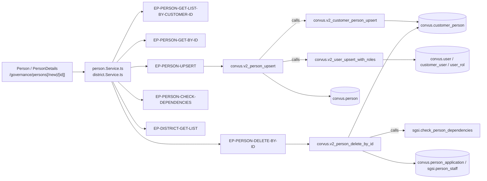

# Gestionar Personas

## Propósito
Mantener el padrón de personas de la organización: identidad (RUT, nombre, correo, teléfono, comuna), su **cargo y área dentro de esta empresa**, sus equipos, sus flags de representante legal / asistente y sus roles de acceso al sistema.

## Entrada desde UI
`/governance/persons` (listado) → `/governance/persons/new` (alta) o `/governance/persons/[id]` (ficha). Además, dos modales de alta rápida invocan esta misma capacidad desde otras superficies: `roles-responsibilities/manual-person-modal.tsx` y `wizard/shared/ManualPersonModal.tsx`.

## Flujo funcional
1. El listado carga `getPersonListByCustomerId()` → `EP-PERSON-GET-LIST-BY-CUSTOMER-ID` y muestra métricas + tabla (con vista de tarjetas en móvil).
2. Clic en una fila → `/governance/persons/[id]`; `PersonDetails` dispara `getPersonById(id)` → `EP-PERSON-GET-BY-ID`, que devuelve la ficha **con `documents[]` embebidos**.
3. La ficha se organiza en pestañas: datos de identidad (`PersonDetailsSection`), documentos (`FLOW-GOV-007`) y capacitaciones (`FLOW-GOV-008`).
4. **Guardar** (`handleSubmitWrapper` → `upsert`) → `EP-PERSON-UPSERT`. Si es un alta, redirige a la ficha del id devuelto.
5. **Eliminar**: `handlePreDelete` llama `checkDependencies(id)` → `EP-PERSON-CHECK-DEPENDENCIES`; si hay dependencias el diálogo las enumera y no permite confirmar; si no, `deleteById` → `EP-PERSON-DELETE-BY-ID` y vuelve al listado.
6. El selector de comuna se alimenta de `EP-DISTRICT-GET-LIST`; los de cargo, área y equipo reutilizan `FLOW-GOV-009`, `FLOW-GOV-002` y `FLOW-GOV-004` en modo lectura.

## Frontend
`Person` / `PersonDetails` → `usePerson()`, `usePosition()`, `useArea()`, `useDistrict()`, `useStaff()` → `personStore` / `districtStore` → `person.Service.ts` / `district.Service.ts`.

## API
`GET /person/getListByCustomerId`, `GET /person/getById`, `POST /person/upsert`, `GET /person/dependencies/:id`, `POST /person/deleteById/:id`, `GET /district/getList`.
Router `/person` montado `admin-or-usuario`; todas las rutas de escritura y la de dependencias declaran `verifyAdminOnly` por ruta.

## Backend
`routers/person.ts` → `controllers/person.ts` → `models/person.ts` → `queries/person.ts`.
El controller de `upsert` hace más que delegar: cuando el payload trae roles, genera contraseña aleatoria (`randomBytes`), la hashea con `bcrypt`, crea/actualiza el usuario y dispara el correo de bienvenida.

## Database
`corvus.v2_customer_person_get_list_by_customer_id`, `corvus.v2_person_get_by_id`, `corvus.v2_person_upsert`, `sgsi.check_person_dependencies`, `corvus.v2_person_delete_by_id` y `sgsi.v2_district_get_list`.
Internas alcanzadas por `calls`: `corvus.v2_customer_person_upsert`, `corvus.v2_user_upsert_with_roles`, `sgsi.v2_person_document_get_by_person_id`, `sgsi.v2_training_document_get_by_training_id`.
Tablas escritas: `corvus.person`, `corvus.customer_person`, `corvus.user`, `corvus.customer_user`, `corvus.user_rol`, `corvus.person_application`, `sgsi.person_staff`.

## Reglas relevantes
- **Modelo post-sprint5**: `position_id`, `area_id`, `is_legal_representative` e `is_assistant` viven en `corvus.customer_person` (**por empresa**), no en `corvus.person`. `v2_person_upsert` ya no escribe esas columnas y delega en `v2_customer_person_upsert`. `district_id` sí sigue en `corvus.person`.
- La regla de **representante legal único por empresa** se aplica ahora dentro de `v2_customer_person_upsert`, scoped por `customer_id`.
- La **baja es tenant-aware**: no borra la persona global; solo hace soft-delete de `customer_person`, `person_application`, `person_staff`, `customer_user` y `user_rol` para el cliente actual. Revoca **todos** los roles del par `(user, customer)` sin filtrar por `application_id`, incluida la fila Admin app-agnóstica.
- `corvus.user.login` se alinea automáticamente con el correo guardado.
- Las asignaciones de equipo se **reemplazan completas** en cada guardado.

## Consideraciones
- **Convergencia**: `EP-PERSON-UPSERT` lo comparten la ficha, el modal de Roles y Responsabilidades y el modal del Wizard — es la misma Operación invocada desde tres superficies, no tres Operaciones (precedente `FLOW-ACT-008/014/016`). `EP-PERSON-GET-BY-ID` lo consume además `/profile`, y `EP-PERSON-GET-LIST-BY-CUSTOMER-ID` es el endpoint más compartido del dominio (Organigrama, Roles y Responsabilidades, Wizard, Activos, Riesgos).
- **Seguridad (tenant isolation)**: `EP-PERSON-CHECK-DEPENDENCIES` **no valida** que la persona pertenezca al cliente autenticado — ni el controller ni `sgsi.check_person_dependencies`, que solo recibe `p_person_id`. Es una asimetría explícita frente a `/area/dependencies` y `/position/dependencies`, que sí validan. Registrado en Hallazgos, no corregido.
- **Bloqueo inalcanzable**: `person-details.tsx:103` y `:361` consumen `useChart()` para deshabilitar editar/eliminar cuando "el organigrama está bloqueado", pero `store/hooks/useChart.tsx` es un stub que devuelve `isLocked: false` de forma permanente — la guarda **nunca se activa**. Se documenta para no describir una regla de negocio inexistente.
- **Trampa de nombres**: en la misma carpeta conviven `person-details.tsx` (la página, 1115 líneas) y `PersonDetails.tsx` (una sub-sección presentacional); en un filesystem case-insensitive es una colisión de import esperando a ocurrir (deuda registrada).
- El endpoint `GET /person/:personId/documents` existe pero **no tiene consumidor**: la pestaña de documentos lee `documents[]` del payload de `getById`. Queda como huérfano en Hallazgos, sin nodo.

## Trazabilidad

