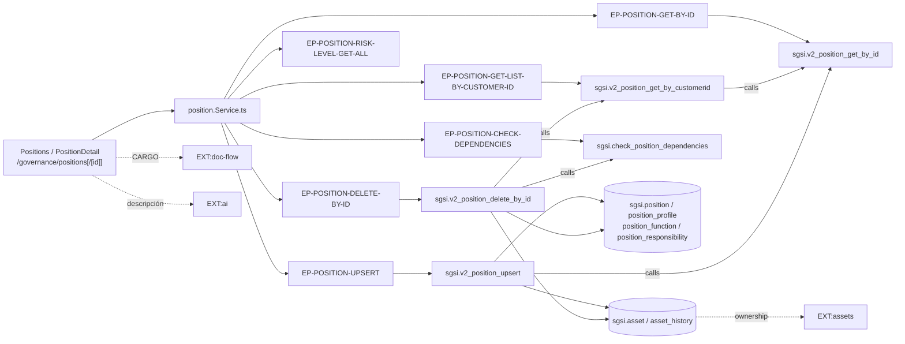

# Gestionar Cargos

## Propósito
Mantener el catálogo de cargos de la organización y su descriptor completo (objetivo, perfil académico, capacitación requerida, experiencia, competencias, autoridad, nivel de riesgo de seguridad, funciones y responsabilidades), y llevarlo por su ciclo de aprobación hasta quedar vigente.

## Entrada desde UI
`/governance/positions` (listado con filtro por estado) → `/governance/positions/[id]` (ficha) o `/governance/positions/new` (alta). Alta rápida también desde `roles-responsibilities/position-modal.tsx` y `wizard/shared/PositionModal.tsx`.

## Flujo funcional
1. El listado carga cargos (`EP-POSITION-GET-LIST-BY-CUSTOMER-ID`) y, en paralelo, los procesos Doc-Flow del tipo `CARGO` (`getAllProcessesByType("CARGO")` + `getMyConfigurations()`) para derivar el **estado** de cada fila: `BORRADOR → EN_CONFIGURACION → EN_APROBACION → PENDIENTE_PUBLICAR → FINALIZADO`, más `DEVUELTO`.
2. La ficha (`PositionDetail`) carga el cargo (`EP-POSITION-GET-BY-ID`), las áreas, las personas y el catálogo de niveles de riesgo (`EP-POSITION-RISK-LEVEL-GET-ALL`), y consulta el proceso activo con `getProcessByEntity("CARGO", id)`.
3. **Guardar** (`doSavePosition`) → `EP-POSITION-UPSERT`. En un alta redirige a la ficha del id devuelto.
4. **Generar con IA**: exige que el cargo esté guardado y tenga nombre; tras confirmar el diálogo de consentimiento llama al servicio de IA y mapea la respuesta al formulario (`mapAIDataToPositionForm`) sin persistirla.
5. **Enviar a aprobación** (`handleSendToApproval`): navega a `/doc-flow/configuration?type=CARGO&entityId=<positionId>&entityName=…&code=<code>`. No hay endpoint propio de Gobierno en este paso.
6. **Revisar**: si el usuario tiene una tarea pendiente como aprobador, la fila/ficha ofrece `EntityReviewModal` (dominio Doc-Flow).
7. **Publicar** (`handleConfirmPublish`): solo el creador del proceso y solo en `PENDIENTE_PUBLICAR`; llama `publishProcess(processId)` (endpoint de Doc-Flow).
8. **Eliminar**: `checkDependencies(id)` → `EP-POSITION-CHECK-DEPENDENCIES`; si hay dependencias el diálogo las enumera (personas, cargos hijos, KPIs, matriz de comunicaciones, acciones de mitigación) y no permite confirmar; si no, `EP-POSITION-DELETE-BY-ID`.

## Frontend
`Positions` / `PositionDetail` → `usePosition()`, `useArea()`, `usePerson()`, `useAI()`, `useDocFlow()` → `positionStore` / `aiStore` → `position.Service.ts` / `ai.Service.ts`.

## API
`GET /position/getPositionListByCustomerId`, `GET /position/getById/:id`, `POST /position/upsert`, `GET /position/risk-levels`, `GET /position/dependencies/:id`, `POST /position/deleteById/:id`.
Las escrituras y el chequeo de dependencias llevan `verifyAdminOnly`; las lecturas de ficha y catálogo son `admin-or-usuario` **intencionalmente**, porque las consume Doc-Flow.

## Backend
`routers/position.ts:16-25` → `controllers/position.ts` → `models/position.ts` → `queries/position.ts`.
El controller traduce los `P0001` de las funciones (nombre duplicado, dependencias activas) a **409**.

## Database
`sgsi.v2_position_get_by_customerid`, `sgsi.v2_position_get_by_id`, `sgsi.v2_position_upsert`, `sgsi.v2_position_risk_level_get_all`, `sgsi.check_position_dependencies` y `sgsi.v2_position_delete_by_id`.
Tablas propias (WRITE): `sgsi.position`, `sgsi.position_profile`, `sgsi.position_function`, `sgsi.position_responsibility`. Catálogo (READ): `sgsi.position_risk_level`. **Cross-domain (WRITE)**: `sgsi.asset`, `sgsi.asset_history`.

## Reglas relevantes
- El nombre del cargo es único por cliente. Además, la **creación falla si ya existe un *activo* con ese nombre**, porque el cargo va a generar uno.
- El `code` se autogenera con `corvus.generate_sgsi_code('DC', …)`.
- `position_function` y `position_responsibility` se **borran y reinsertan completas** en cada guardado.
- No se puede eliminar un cargo con personas, cargos hijos, KPIs, filas de la matriz de comunicaciones o acciones de mitigación asociadas.
- El cargo solo es editable en `BORRADOR`, `DEVUELTO`, `FINALIZADO` o `VIGENTE`; en `EN_APROBACION` la UI lo bloquea.
- Solo el creador original del proceso puede publicar (regla de Doc-Flow, validada en controller y en `doc_flow_publish`).

## Consideraciones
- **Cascada Cargo → Activo (DOM-GOV → DOM-ACT), confirmada**: al **crear**, `v2_position_upsert` inserta un activo en `sgsi.asset` con `base_asset_type_id` **hardcodeado** al literal `'5f7b9b62-7c85-4ced-9112-28e19280fbff'` (TA-13 "Roles y Funciones"), `name` y `area_id` heredados del cargo y `position_id` como vínculo, más una entrada en `sgsi.asset_history`. Al **editar** sincroniza `name` y `area_id`, pero **no crea** el activo si falta — de ahí la migración correctiva acotada `2026-07-06_backfill_position_asset_link.sql`, que no es global. Al **eliminar**, `v2_position_delete_by_id` da de baja el activo vinculado y registra el historial. Desde el lado de Activos la relación ya está protegida: `v2_asset_delete_by_id` bloquea si `position_id IS NOT NULL` y `v2_asset_upsert` no deja editar `name`/`area_id`/`base_asset_type_id` de un activo con cargo, así que la desincronización no puede originarse en DOM-ACT.
- **La publicación de Doc-Flow reescribe el cargo**: al publicar un proceso con `entity_type='CARGO'`, `controllers/doc-flow.ts:343` llama `models/position.ts#upsert` con los datos del snapshot **dentro de la misma transacción**, antes de generar el documento `DESCRIPCION_DE_CARGO`. Es decir, el cargo (y en cascada su activo) se reescriben con el snapshot, no necesariamente con el estado actual. Esa escritura ocurre en TypeScript, no en `sgsi.doc_flow_publish` (que **no tiene rama `CARGO`**), por lo que queda documentada en prosa y en `notes:` a ambos lados — ver `FLOW-DOCFLOW-006` — sin inventar un tipo de relación nuevo en el Explorer.
- **Seguridad (tenant isolation, no corregido)**: `EP-POSITION-GET-BY-ID` no filtra por `customer_id` ni en el controller ni en la función SQL, así que cualquier usuario autenticado puede leer la ficha completa de un cargo de otro cliente.
- **Bloqueo inalcanzable**: `positions.tsx:51` y `position-detail.tsx:120` consumen `useChart()` para deshabilitar acciones cuando "el organigrama está bloqueado", pero ese hook es un stub que devuelve `isLocked: false` de forma permanente — la guarda nunca se activa.
- **Deuda**: `v2_position_get_by_customerid` invoca `v2_position_get_by_id` una vez por cargo (N+1 en SQL); `controllers/position.ts:8` importa `CustomerModel` y nunca lo usa; existen **tres** modales de alta de cargo casi idénticos (Cargos, Roles y Responsabilidades, Wizard).
- **Convergencia**: `EP-POSITION-UPSERT` es invocado desde tres superficies de UI **y** desde el backend de Doc-Flow; `EP-POSITION-GET-BY-ID` lo consumen también la configuración del flujo y el modal de revisión de Doc-Flow.

## Trazabilidad

