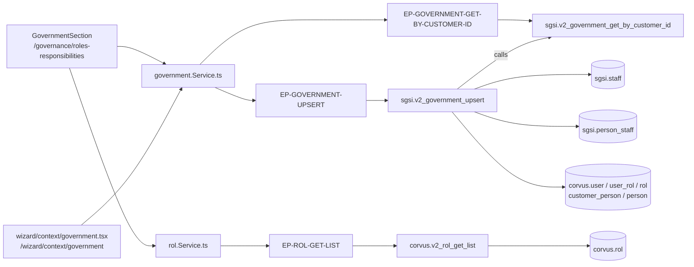

# Mapear el Gobierno del SGSI

## Propósito
Designar quién manda en el SGSI: **un Responsable del SGSI** y **un conjunto de personas de Alta Dirección**. Este mapeo es el que el resto del sistema usa para saber a quién notificar y quién debe aprobar los documentos finales.

## Entrada desde UI
Dos superficies, una sola Operación:
- `/governance/roles-responsibilities` → primera sección de la pantalla (`GovernmentSection`), con el botón flotante **"Guardar mapeo completo"**.
- `/wizard/context/government` → paso equivalente del Wizard, con su propia UI y su propio botón "Siguiente".

## Flujo funcional
1. Al montar se cargan personas (`EP-PERSON-GET-LIST-BY-CUSTOMER-ID`, ver `FLOW-GOV-005`), roles (`EP-ROL-GET-LIST`) y el gobierno vigente (`EP-GOVERNMENT-GET-BY-CUSTOMER-ID`).
2. Si el backend aún no devuelve datos, la pantalla **deriva un gobierno tentativo** desde `personList` + `rolList` con `getGovernmentFromPersons` (`utils/wizardFunctions.ts`) — es solo un valor por defecto en memoria, no se persiste hasta guardar.
3. **Responsable del SGSI**: `Select` limitado a `adminPersons`, las personas cuyo array `roles` incluye el rol de código `Admin`.
4. **Alta Dirección**: `MultiSelectModal` para añadir integrantes y una `X` por fila para quitarlos; el estado vive en `highDirectionIds`.
5. **Alta manual de persona**: `ManualPersonModal` permite crear una persona sin salir de la pantalla — es una invocación de `FLOW-GOV-005` (`EP-PERSON-UPSERT`), no una acción propia. La persona creada **no** se añade automáticamente a la Alta Dirección.
6. **Guardar**: el botón flotante de la pantalla llama, vía `useImperativeHandle`, al `handleGuardar` de `GovernmentSection` → `upsertGovernment({responsibleId, highDirectionIds})` → `EP-GOVERNMENT-UPSERT`, y luego recarga gobierno y personas.

## Frontend
`RolesResponsibilities` → `GovernmentSection` (ref) → `useGovernment()` / `usePerson()` / `useRol()` → `governmentStore` / `rolStore` → `government.Service.ts` / `rol.Service.ts`.

## API
- `GET /government/getByCustomerId` → `EP-GOVERNMENT-GET-BY-CUSTOMER-ID` (`admin-or-usuario`)
- `POST /government/upsert` → `EP-GOVERNMENT-UPSERT` (**`verifyAdminOnly`** por ruta)
- `GET /rol/getList` → `EP-ROL-GET-LIST`

## Backend
`routers/government.ts:8-9` → `controllers/government.ts` → `models/government.ts` → `queries/government.ts`.
El controller valida el body con `schemas/government.ts#upsertSchema` y traduce el `P0001` de la función (responsable sin rol Admin o ajeno a la empresa) a un **409**.

## Database
`sgsi.v2_government_get_by_customer_id` (`funciones_sgsi.sql:18431-18492`) y `sgsi.v2_government_upsert` (`:18496-18630`), que llama a la primera para devolver el estado resultante.
Tablas: `sgsi.staff` y `sgsi.person_staff` (WRITE); `corvus.user`, `corvus.user_rol`, `corvus.rol`, `corvus.customer_person`, `corvus.person` (READ).

## Reglas relevantes
- **No existe una tabla `government`.** El estado se materializa como filas de `sgsi.person_staff` contra dos `sgsi.staff` de sistema, identificados de forma *rename-proof* por `(company_id, code)`: **`RESP_SGSI`** y **`ALTA_DIR`**. La función los auto-siembra con `ON CONFLICT` si no existen.
- **Zero-trust sobre el responsable**: debe tener rol `Admin` para ese `customer + application` (o un rol `Admin` app-agnóstico con `application_id IS NULL`) **y** pertenecer al cliente vía `corvus.customer_person`. Si no, la función lanza `P0001`.
- La Alta Dirección se **reemplaza por completo** en cada guardado: soft-delete de todas las filas del staff `ALTA_DIR` y reinserción del array recibido.
- Si hubiera varias asignaciones de `RESP_SGSI`, la lectura devuelve la **última por `created_at`**.

## Consideraciones
- **Convergencia declarada sin duplicar Operación**: las dos superficies (pantalla y Wizard) comparten endpoints, funciones y tablas; siguiendo el precedente de `FLOW-SOA-001` y `FLOW-CTX-001`, se declaran ambas páginas en `frontend.pages` y el Wizard como dependencia externa, en lugar de crear un segundo Flow.
- **El botón "Guardar mapeo completo" solo guarda esta sección.** Pese a su nombre, `roles-responsibilities.tsx:22-29` invoca únicamente `governmentSectionRef.current.guardar()`; los Comités (`FLOW-GOV-004`) y los Cargos (`FLOW-GOV-009`) se guardan desde sus propios modales.
- **Acoplamiento con Comités**: `sgsi.staff` es la misma tabla que usa `FLOW-GOV-004`, por lo que el gobierno aparece en el listado de equipos como dos entradas de sistema.
- **Seguridad**: `EP-GOVERNMENT-UPSERT` está correctamente protegido con `verifyAdminOnly`. `EP-GOVERNMENT-GET-BY-CUSTOMER-ID` no lo está y no se le encontró consumidor no-admin: queda clasificado como **AMBIGUOUS** (lectura correctamente scoped, impacto bajo), no como vulnerabilidad.
- `controllers/government.ts:21` deja un `console.log("[DEBUG]…")` con el payload completo en código desplegado (deuda registrada).

## Trazabilidad

