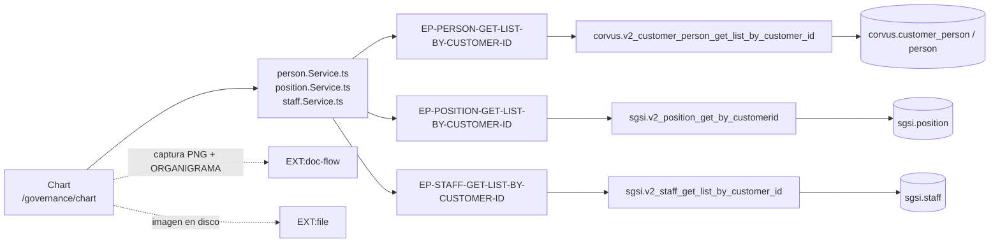

# Consultar el organigrama y enviarlo a aprobación

## Propósito
Visualizar la estructura jerárquica de la organización —construida a partir de cargos, personas y equipos— y someterla al flujo documental para que quede aprobada y publicada como documento formal.

## Entrada desde UI
`/governance/chart`, sexto ítem de la sección Gobierno del SGSI.

## Flujo funcional
1. Al montar, `Chart` carga en paralelo personas, cargos y equipos (`EP-PERSON-GET-LIST-BY-CUSTOMER-ID`, `EP-POSITION-GET-LIST-BY-CUSTOMER-ID`, `EP-STAFF-GET-LIST-BY-CUSTOMER-ID`).
2. `transformDataToOrgChart` arma el árbol **en el cliente**: relaciona cada persona con su cargo por `person.positionId` y encadena los cargos por `position.positionParentId`; los equipos aportan la relación de superior cuando corresponde. El render lo hace `@balkangraph/orgchart.js`.
3. Si no hay personas o no hay cargos, muestra el estado vacío en lugar del gráfico.
4. **Refrescar** vuelve a pedir las tres listas.
5. **Enviar a aprobación** (`handleGoToFlowConfig`): captura el SVG del organigrama a base64 (`utils/organigrama-image-capture.ts`), lo deja en `sessionStorage["organigrama_pending_capture"]` y navega a `/doc-flow/configuration?type=ORGANIGRAMA&entityId=<customerId>&entityName=Organigrama&code=ORG`. La página de configuración recoge esa imagen (TTL de 10 minutos) y la envía como `entity_data.organigramaImage`.
6. **Revisar** (`EntityReviewModal`) y **Publicar** (`publishProcess`) se resuelven contra endpoints de Doc-Flow; el estado del proceso se consulta con `getProcessByEntity("ORGANIGRAMA", customerId)`.
7. Clic en una persona del gráfico navega a su ficha (`/governance/persons/[id]`).

## Frontend
`Chart` → `usePerson()`, `usePosition()`, `useStaff()`, `useDocFlow()`, `useCustomer()` → `personStore` / `positionStore` / `staffStore`.

## API
Solo lecturas, todas compartidas con otras Operaciones: `GET /person/getListByCustomerId`, `GET /position/getPositionListByCustomerId`, `GET /staff/getListByCustomerId`.
El envío y la publicación usan endpoints de `DOM-DOCFLOW`, no de Gobierno.

## Backend
No hay backend propio de esta Operación: reutiliza los controllers de Personas, Cargos y Equipos.

## Database
No hay tabla ni función propias. Las lecturas resuelven en `corvus.v2_customer_person_get_list_by_customer_id`, `sgsi.v2_position_get_by_customerid` y `sgsi.v2_staff_get_list_by_customer_id`.

## Reglas relevantes
- **El Organigrama no es una entidad persistida.** Es una proyección de Cargos + Personas + Equipos; no tiene tabla, ni endpoint, ni id propio.
- Por eso el proceso de Doc-Flow usa **`entity_id = customerId`** — patrón único en todo el SGSI, distinto al de cualquier otra entidad aprobable.
- Lo que se aprueba y se publica es una **imagen PNG capturada en el navegador**, no datos de la base.
- El área del documento es obligatoria al enviar; si no se elige, `sgsi.v2_document_area_ensure` (dominio Doc-Flow) crea o localiza "Recursos Humanos".
- Solo el creador original del proceso puede publicar.

## Consideraciones
- **Deuda legacy con riesgo de bloqueo (no corregida)**: el organigrama **en pantalla** resuelve el cargo de cada persona por `corvus.customer_person.position_id` (columna vigente post-sprint5), pero el **snapshot que se envía a aprobación**, armado por `sgsi.v2_document_workflow_snapshot_organigrama` (`funciones_sgsi.sql:16864`), lo lee de `corvus.person.position_id`, columna que la migración sprint5 dejó de escribir.
  Se verificó que **hoy no hay impacto funcional**: ningún consumidor lee `data.persons[]` ni `metadata` del snapshot — tanto `OrganigramaPreview` (modal e inbox) como `document-preview.tsx` renderizan únicamente `organigramaImageBase64`. El campo obsoleto se escribe y nunca se lee. La clasificación es por tanto **Legacy + Technical Debt**, no divergencia funcional activa.
  El riesgo real es futuro: cuando se ejecute el `DROP COLUMN` pendiente de `sprint5/3_2026-09-07_drops_columnas_obsoletas.sql`, esa función fallará y `models/doc-flow.ts:148-150` lanzará `badImplementation`, **bloqueando por completo el envío del organigrama a aprobación**.
- **La imagen viaja por `sessionStorage`**, no por la URL ni por el store: si el usuario tarda más de 10 minutos entre capturar y configurar, la captura caduca y hay que repetirla.
- `chart.tsx:81` lee `customer` del store pero **nunca dispara `getCustomerById()`**, así que el nombre de archivo del PNG cae al fallback `organigrama_empresa.png` salvo que el usuario haya visitado `/governance/company` en la misma sesión (deuda menor registrada).
- **Deslinde**: `sgsi.v2_document_workflow_snapshot_organigrama` ya está documentada en `DOM-DOCFLOW` (`FN-V2-DOCUMENT-WORKFLOW-SNAPSHOT-ORGANIGRAMA`); no se duplica aquí, porque los IDs `FN-*` son únicos en todo el grafo.
- La exportación a PNG se documenta aparte, en `FLOW-GOV-011`, por ser 100 % client-side.

## Trazabilidad

