# Cambiar estado de iniciativa

## Propósito

Transicionar una iniciativa entre estados (planificada → en curso → completada / cancelada) registrando justificación de cada cambio en tabla de auditoría.

## Entrada desde UI

Botón en fila de iniciativa (InitiativeColumn) abre modal con selector de estado y campo de justificación (required).

## Flujo funcional

1. Usuario selecciona iniciativa y hace clic en botón de cambio de estado
2. Modal pide:
   - `newStatus` — estado destino
   - `justification` — razón del cambio (required, min 1 char)
3. Valida transición permitida (ver Reglas)
4. Envío: `moveInitiative(initiativeId, newStatus, justification)` → `POST /initiative/changeStatus`
5. Backend: `initiative_change_status` valida transición, actualiza estado, registra en log
6. Retorna lista actualizada

## Frontend

`InitiativeColumn` → `useInitiatives()` → `initiativeStore` → `initiative.Service.ts`.

Modal con SelectModal para estado y TextField para justificación.

## API

- `POST /initiative/changeStatus` → `EP-INIT-CHANGE-STATUS` (acceso: `admin-or-usuario`)

Request:
```json
{
  "initiativeId": "uuid",
  "newStatus": "en_curso|completada|cancelada",
  "justification": "string (required, non-empty)"
}
```

Response: array de iniciativas actualizadas

## Backend

`routers/initiative.ts:8` → `controllers/initiative.ts#changeStatus` → `models/initiative.ts#changeStatus` → `queries/initiative.ts#_changeStatus`.

Validation: `changeStatusSchema.validate(req.body)`.

## Database

**Function:** `sgsi.initiative_change_status(p_initiative_id uuid, p_company_id uuid, p_new_status varchar, p_justification text, p_user_id uuid) RETURNS json`

**State Machine:**
```
  planificada → {en_curso, cancelada}
  en_curso    → {completada, cancelada}
  completada  → terminal (no cambios)
  cancelada   → terminal (no cambios)
```

**Reglas de validación:**
- Si `p_new_status = 'cancelada'` y `v_from_status NOT IN ('planificada', 'en_curso')` → error
- Si `v_from_status = 'cancelada'` → error
- Si `v_from_status = 'completada' AND p_new_status <> 'completada'` → error
- Si `v_from_status = 'en_curso' AND p_new_status = 'planificada'` → error (no retroces)
- Si `NULLIF(TRIM(p_justification), '') IS NULL` → error

**Operaciones:**
1. SELECT estado actual `v_from_status` de `sgsi.initiative`
2. Valida transición
3. UPDATE `sgsi.initiative` SET status, progress (100 si completada), completed_at, updated_by, updated_at
4. INSERT `sgsi.initiative_status_log` (initiative_id, from_status, to_status, justification, created_by)
5. Retorna lista actualizada

**Tablas tocadas:**
- `sgsi.initiative` (UPDATE: status, progress, completed_at, updated_by, updated_at)
- `sgsi.initiative_status_log` (INSERT: audit record)

## Reglas relevantes

- **Justificación mandatory:** no puede ser vacía/null
- **No retroceso:** no se puede pasar de en_curso a planificada
- **Terminal states:** completada y cancelada no permiten cambios adicionales
- **Completed at:** se registra automáticamente al pasar a 'completada'
- **Auditoría completa:** cada cambio genera row en initiative_status_log

## Consideraciones

- **Workflow restrictivo:** state machine previene transiciones inválidas a nivel de BD
- **Sin dependencias:** cambiar estado de iniciativa no afecta riesgos/controles/personas vinculados
- **Audit trail:** initiative_status_log permite reconstruir histórico de cambios

## Trazabilidad

```mermaid
flowchart LR
  UI["InitiativeColumn\nBotón cambio estado + modal"] --> Service["initiative.Service.ts\nmoveInitiative(id, status, justification)"]
  Service --> EP["POST /initiative/changeStatus"]
  EP --> Controller["controllers/initiative.ts#changeStatus"]
  Controller --> Model["models/initiative.ts#changeStatus"]
  Model --> Query["queries/initiative.ts#_changeStatus"]
  Query --> Fn["sgsi.initiative_change_status"]
  Fn -->|validate| SM["State Machine"]
  SM -->|if valid| T1["sgsi.initiative UPDATE"]
  SM -->|always| T2["sgsi.initiative_status_log INSERT"]
  T1 --> Response["list actualizado"]
  T2 --> Audit["Auditoría registrada"]
```


