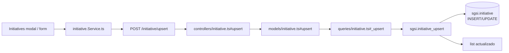

# Crear/Actualizar iniciativa

## Propósito

Crear una iniciativa nueva del SGSI o editar una existente, especificando su propósito, estado, progreso, responsable y vinculaciones opcionales con riesgos y controles.

## Entrada desde UI

Modal de crear/editar en `/planning-resources/initiative`.

## Flujo funcional

1. Usuario abre modal de nueva iniciativa o edita una existente
2. Completa formulario:
   - `title` (requerido)
   - `status` (default: 'planificada')
   - `progress` (0-100, %)
   - `completedAt` (timestamp, si aplica)
   - `linkRiskId` (FK opcional)
   - `linkControlId` (FK opcional)
   - `leadResponsibleId` (FK persona opcional)
   - `estimatedBudget` (numérico)
   - `infrastructureTools` (texto)
3. Envío: `addOrUpdateInitiative(data)` → `POST /initiative/upsert`
4. Backend: `initiative_upsert` inserta o actualiza
5. Retorna lista actualizada

## Frontend

`Initiatives` → `useInitiatives()` → `initiativeStore` → `initiative.Service.ts`.

Modal con form, selects para riesgos/controles/personas.

## API

- `POST /initiative/upsert` → `EP-INIT-UPSERT` (acceso: `admin-or-usuario`)

Request: JSON con estructura `{ id?, companyId, title, status, progress, ... }`

Response: array de iniciativas actualizadas

## Backend

`routers/initiative.ts:7` → `controllers/initiative.ts#upsert` → `models/initiative.ts#upsert` → `queries/initiative.ts#_upsert`.

Validation: `upsertSchema.validate({ ...req.body, companyId: customerId })`.

## Database

**Function:** `sgsi.initiative_upsert(p_json_data jsonb, p_user_connected_id uuid) RETURNS json`

**Operaciones:**
1. Parsea JSON: extrae id, companyId, title (required), status (default 'planificada')
2. Si id NULL → INSERT `sgsi.initiative`
3. Si id presente → UPDATE `sgsi.initiative`
4. Retorna lista actualizada

**Tablas tocadas:**
- `sgsi.initiative` (INSERT/UPDATE)
- Audit: `created_by`, `created_at`, `updated_by`, `updated_at`

## Reglas relevantes

- **Sin restricciones de estado en create/update:** puede crearse/editarse en cualquier estado desde UI
- **Los cambios de estado se hacen mediante FLOW-INIT-002**, no aquí
- **Vinculaciones son FK simples:** no valida que riesgo/control exista

## Consideraciones

- **Dependencias READ-ONLY:** initiative no escribe en riesgos, controles ni personas
- **Sin cascadas:** actualizar initiative no afecta riesgos/controles vinculados

## Trazabilidad

