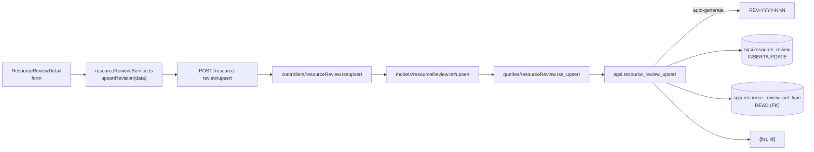

# Crear/Actualizar revisión de recursos

## Propósito

Registrar una sesión de revisión de suficiencia de recursos del SGSI, especificando tipo de acto (comité, asamblea, etc.), fecha, participantes, decisiones y evidencia.

## Entrada desde UI

- **Nueva:** Botón «Nueva Revisión» en `/planning-resources/resource-review`
- **Edición:** Clic en fila → navega a `/planning-resources/resource-review/{id}`

## Flujo funcional

1. Usuario abre formulario de nueva revisión o edita una existente
2. Completa:
   - `fechaSesion` (date, required) — fecha de la sesión
   - `tipoActoId` (UUID, required) — tipo de acto (comité, asamblea, etc.)
   - `participantPersonIds[]` — array de personas participantes
   - `resumenDecisiones` — resumen de lo decidido
   - `estadoSuficiencia` — "suficiente" (default) u otro
   - `evidencia` — archivo adjunto (opcional)
3. Envío: `upsertRevision(data)` → `POST /resource-review/upsert`
4. Backend: `resource_review_upsert` genera código (si NEW) e inserta/actualiza
5. Retorna lista actualizada

## Frontend

`ResourceReviewDetail` → `useResourceReview()` → `resourceReviewStore` → `resourceReview.Service.ts`.

Formulario con react-hook-form, Zod validation, multi-select para participantes, datepicker, evidencia upload.

## API

- `POST /resource-review/upsert` → `EP-RESREV-UPSERT` (acceso: `admin-or-usuario`)

Request:
```json
{
  "id": "uuid?",
  "customerId": "uuid (auto-added by controller)",
  "fechaSesion": "YYYY-MM-DD",
  "tipoActoId": "uuid",
  "participantPersonIds": ["uuid", ...],
  "resumenDecisiones": "string",
  "estadoSuficiencia": "string",
  "evidenciaPath": "string?",
  "evidenciaFileName": "string?",
  "evidenciaMimeType": "string?",
  "evidenciaSizeBytes": "number?"
}
```

Response:
```json
{
  "list": [...],
  "id": "uuid"
}
```

## Backend

`routers/resource-review.ts:20` → `controllers/resource-review.ts#upsert` → `models/resource-review.ts#upsert` → `queries/resource-review.ts#_upsert`.

Validation: `upsertSchema.validate({ ...req.body, customerId })`.

## Database

**Function:** `sgsi.resource_review_upsert(p_json_data jsonb, p_user_connected_id uuid) RETURNS json`

**Operaciones:**
1. Parsea JSON: extrae id, fechaSesion (required), tipoActoId (required), participantes, resumen, estado (default 'suficiente')
2. Si id NULL → auto-genera código REV-YYYY-NNN, INSERT `sgsi.resource_review`
3. Si id presente → UPDATE `sgsi.resource_review`
4. Retorna {list: [...], id: uuid}

**Código autogenerado:**
- Formato: `REV-YYYY-NNN` (ej: REV-2026-001, REV-2026-002)
- Secuencia por año y cliente
- Imposible duplicar dentro del mismo año/cliente

**Tablas tocadas:**
- `sgsi.resource_review` (INSERT/UPDATE)
- `sgsi.resource_review_act_type` (READ: para validar tipoActoId)
- Audit: `created_by`, `created_at`, `uploaded_by`, `updated_by`, `updated_at`

## Reglas relevantes

- **Código autogenerado:** único por año/cliente, no editable
- **Fecha de sesión:** requerida, puede ser pasada, presente o futura
- **Tipo de acto:** FK requerida a catálogo (no se valida existencia en función)
- **Participantes:** array de UUIDs, sin validación
- **Estado de suficiencia:** valor libre, sin restricción

## Consideraciones

- **Sin workflow:** no hay cambios de estado adicionales
- **Evidencia es optional:** puede crearse revisión sin archivo
- **No es recurrente:** cada sesión se registra manualmente

## Trazabilidad


