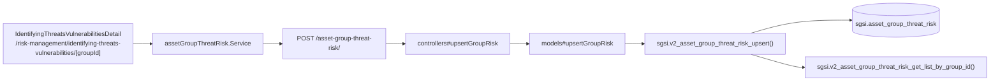

# Analizar amenazas y vulnerabilidades de un grupo de activos

## Propósito
Registrar, para un grupo de activos, las amenazas y vulnerabilidades aplicables (del catálogo ISO 27001 por tipo de activo, o agregadas manualmente) y su nivel de probabilidad/impacto, como base del análisis de riesgo inherente del grupo.

## Entrada desde UI
`/risk-management/identifying-threats-vulnerabilities` → click en un grupo → `/risk-management/identifying-threats-vulnerabilities/[groupId]`.

## Flujo funcional
1. Al entrar, el frontend pide el detalle del grupo (`useAsset().getAssetGroupById`, Activos) y la lista combinada de amenazas/vulnerabilidades vía `useAssetGroupRisks(groupId)` → `GET /asset-group-threat-risk/:assetGroupId`.
2. La lista combina dos orígenes: filas "base" (catálogo determinista ISO 27001 según el tipo de activo del grupo, materializadas como virtuales con `id` nulo hasta que el usuario les asigna probabilidad/impacto) y filas "custom" (agregadas manualmente vía `AddCustomThreatModal` o `SuggestedRisksModal`, cuando no calzan con el catálogo del tipo de activo).
3. Al asignar probabilidad/impacto o excluir una amenaza, el frontend llama `POST /asset-group-threat-risk/` con el payload completo (incluye `id` si la fila ya estaba materializada).
4. `sgsi.v2_asset_group_threat_risk_upsert` hace `UPDATE` por PK si `id` viene informado, o `INSERT` si es una fila nueva (materialización de una fila "base" virtual, o alta de una fila "custom").
5. La función retorna la lista actualizada llamando a `sgsi.v2_asset_group_threat_risk_get_list_by_group_id`.

## Frontend
- `IdentifyingThreatsVulnerabilitiesDetail` → `useAssetGroupRisks(groupId).upsertRisk`.

## API
`GET /asset-group-threat-risk/:assetGroupId` y `POST /asset-group-threat-risk/` — acceso `admin-or-usuario`.

## Backend
`routers/assetGroupThreatRiskRouter.ts` → `controllers/assetGroupThreatRiskController.ts#{getRisksByGroupId,upsertGroupRisk}` → `models/assetGroupThreatRisk.ts` → `queries/assetGroupThreatRisk.ts`.

## Database
`sgsi.v2_asset_group_threat_risk_upsert` (`funciones_sgsi.sql:10900-10978`):
- `UPDATE`/`INSERT` sobre `sgsi.asset_group_threat_risk`.
- Retorna vía `sgsi.v2_asset_group_threat_risk_get_list_by_group_id` (`funciones_sgsi.sql:10679-10795`), que combina catálogo base + filas custom.

## Reglas relevantes
- La exclusión de una amenaza a nivel de grupo **no tiene endpoint propio** — se hace con este mismo endpoint pasando `isExcluded:true`. Esto es asimétrico respecto al nivel de activo individual (legacy), que sí tiene un endpoint dedicado `/asset-threat-risk/exclude` (huérfano — ver `docs/00-catalog/riesgos.md`).
- Las filas "base" son virtuales (sin fila real en `asset_group_threat_risk`) hasta que se guarda una evaluación o exclusión sobre ellas.

## Consideraciones
- **Convergencia inversa**: FLOW-RSK-011 (Definir tratamiento por grupo) puede materializar una fila nueva en esta misma tabla (`asset_group_threat_risk`) si el tratamiento se define sobre un escenario "virtual" sin fila propia todavía — es decir, Tratamiento puede escribir datos de Identificación.
- Los datos generados aquí **no aparecen en la Matriz de Riesgo** (FLOW-RSK-005): esa función lee de `sgsi.asset_threat_risk` (legacy, por activo individual) y `sgsi.organizational_risk`, nunca de `sgsi.asset_group_threat_risk` — ver hallazgo en `docs/00-catalog/riesgos.md`.

## Trazabilidad

