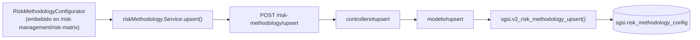

# Configurar metodología de riesgo

## Propósito
Definir el apetito de riesgo (umbral 1-16) y los rangos de criticidad 4x4/3x3 usados para clasificar y colorear la Matriz de Riesgo del cliente.

## Entrada desde UI
Botón **"Configurar metodología"** dentro de `/risk-management/risk-matrix` (no tiene ruta propia — se embebe como panel dentro de la Matriz).

## Flujo funcional
1. `group-risk-matrix.tsx` obtiene la metodología actual como parte de la respuesta de `getMatrixByCustomerId` (campo `methodology`, ver FLOW-RSK-005) y se la pasa como `initialConfig` a `RiskMethodologyConfigurator`.
2. Al guardar, `group-risk-matrix.tsx` llama `useRiskMethodology().upsertMethodology(settings)` → `POST /risk-methodology/upsert`.
3. `sgsi.v2_risk_methodology_upsert` valida en PL/pgSQL (no solo en frontend): apetito entre 1 y 16, rangos 4x4/5x5 ordenados, sin solapamiento, continuos de 1 a 16, cubriendo exactamente ese rango.
4. Tras guardar, se vuelve a pedir la matriz completa (`getMatrixByCustomerId`) para reflejar la nueva clasificación.

## Frontend
- `GroupRiskMatrix` → `useRiskMethodology().upsertMethodology` → `RiskMethodologyConfigurator` (presentacional, recibe `initialConfig`/`onSave` por props).

## API
`GET /risk-methodology/getMethodologyByCustomerId`, `POST /risk-methodology/upsert` — acceso `admin-only`.

## Backend
`routers/riskMethodology.ts` → `controllers/riskMethodology.ts` → `models/riskMethodology.ts`.

## Database
`sgsi.v2_risk_methodology_upsert` (`funciones_sgsi.sql:24272-24381`): `INSERT ... ON CONFLICT (customer_id) DO UPDATE` sobre `sgsi.risk_methodology_config`, con validaciones `RAISE EXCEPTION` de rango y continuidad. `sgsi.v2_risk_methodology_get` (`funciones_sgsi.sql:24242-24267`) retorna `NULL` (no error) si el cliente no configuró nada aún.

## Reglas relevantes
- Si no existe configuración, la Matriz de Riesgo usa un apetito por defecto de 6 y 3 zonas fijas (Aceptable/Tolerable/Inaceptable) embebidas directamente en `sgsi.v2_risk_matrix_get` — el configurador no es obligatorio para que la Matriz funcione.

## Consideraciones
- Es una Operación con tabla y función propias (`sgsi.risk_methodology_config`), aunque no tenga ruta de navegación dedicada — se documenta como Operación separada por el mismo criterio usado en Activos para entidades con identidad técnica propia, aunque su UI viva embebida en otra pantalla.

## Trazabilidad

