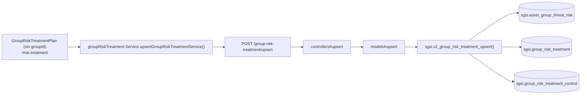

# Definir tratamiento de riesgo — vista consolidada (todos los grupos)

## Propósito
Mostrar, para todos los grupos de activos del cliente, un resumen de sus escenarios de riesgo con y sin tratamiento definido, y permitir definir/editar el tratamiento (estrategia, responsable, plan de acción, riesgo residual, controles SoA) sin entrar al detalle de un grupo específico.

## Entrada desde UI
Menú **Tratamiento de Riesgos → Plan de Tratamiento** → `/risk-treatment` (sin `groupId`).

## Flujo funcional
1. `GroupRiskTreatmentPlanContent` (sin `groupId`) llama `useGroupRiskTreatment().fetchList()` → `GET /group-risk-treatment/getList`, que retorna **todos** los grupos vigentes del cliente con sus escenarios (la función no acepta ni filtra por `groupId`).
2. El frontend agrupa el arreglo plano `risks` por `groupId` para renderizar una `GroupTreatmentCard` por grupo.
3. Al definir/editar el tratamiento de un escenario desde `TreatmentDefinitionForm`, llama `POST /group-risk-treatment/upsert`.
4. El controller (`groupRiskTreatmentController.ts#upsert`) resuelve permisos (admin / owner del grupo / delegado), aplica un candado de reapertura si el escenario ya tiene acciones con avance registrado, y valida el plan (fecha objetivo obligatoria, control SoA obligatorio si la estrategia es mitigar/transferir) **antes** de llamar al Model.
5. `sgsi.v2_group_risk_treatment_upsert` materializa el escenario si era virtual, escribe `sgsi.group_risk_treatment`, y reemplaza por completo los controles vinculados (`DELETE`+`INSERT`) en `sgsi.group_risk_treatment_control`.

## Frontend
- `GroupRiskTreatmentPlan` (sin `groupId`) → `GroupRiskTreatmentPlanContent` → `useGroupRiskTreatment()`.

## API
`GET /group-risk-treatment/getList`, `POST /group-risk-treatment/upsert`, `GET /risk-treatment/strategies` — acceso `admin-or-usuario`.

## Backend
`routers/groupRiskTreatmentRouter.ts` → `controllers/groupRiskTreatmentController.ts#{getList,upsert}` → `models/groupRiskTreatment.ts` → `queries/groupRiskTreatment.ts`. El catálogo de estrategias viene de `routers/riskTreatment.ts#getStrategies`.

## Database
`sgsi.v2_group_risk_treatment_upsert` (`funciones_sgsi.sql:18990-19143`):
- Materializa `sgsi.asset_group_threat_risk` si el escenario era virtual.
- `WRITE` sobre `sgsi.group_risk_treatment` y `sgsi.group_risk_treatment_control` (reemplazo completo).
- Retorna vía `sgsi.v2_group_risk_treatment_get_list`.

## Reglas relevantes
- `RAISE EXCEPTION` en el controller (no en SQL) si falta la fecha objetivo, el residual, o el control SoA obligatorio para mitigar/transferir.
- El reemplazo completo de controles en cada guardado puede sobrescribir vínculos agregados desde "Vínculo de Controles" (SoA) si el estado local del formulario está desatrasado — ver dependencia externa entrante en `docs/00-catalog/riesgos.md`.

## Consideraciones
- **Corrección respecto al diseño previamente planteado**: se había asumido que esta vista ("customer-wide") usaba `/risk-treatment/upsert` (con convergencia interna activo/organizacional dentro de `sgsi.v2_risk_treatment_upsert`). Al leer `group-risk-treatment-plan.tsx` se confirmó que el componente usa `useGroupRiskTreatment()` para **toda** su data (riesgos, métricas, tratamiento, acciones) tanto con `groupId` como sin él — `useRiskTreatment()` solo se usa aquí para el catálogo de estrategias (`GET /risk-treatment/strategies`). El resto del router `/risk-treatment` (`upsert` + 7 endpoints de `actions/*`) está huérfano — ver `docs/00-catalog/riesgos.md`. Esta Operación y FLOW-RSK-011 son una **convergencia real** (mismo endpoint, misma función), análoga a Crear/Editar activo en el piloto Activos: la diferencia funcional es únicamente si `groupId` está presente (filtra a un grupo) o ausente (muestra todos).

## Trazabilidad

