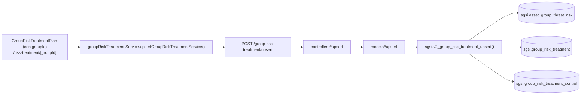

# Definir tratamiento de riesgo — por grupo específico

## Propósito
Definir/editar el tratamiento de los escenarios de riesgo de UN grupo de activos puntual, con el mismo formulario y reglas que la vista consolidada, pero acotado a ese grupo.

## Entrada desde UI
`/risk-treatment` → click en la tarjeta de un grupo → `/risk-treatment/[groupId]`; o navegación directa con el `groupId` en la URL.

## Flujo funcional
Idéntico a FLOW-RSK-010 — mismo componente (`GroupRiskTreatmentPlanContent`), mismo hook (`useGroupRiskTreatment`), mismos endpoints. La única diferencia es que `groupId` llega informado como prop/parámetro de ruta, y el componente filtra en el cliente el arreglo `risks` (que siempre trae **todos** los grupos) para mostrar solo el grupo activo y su detalle de escenarios/acciones.

## Frontend
- `GroupRiskTreatmentPlan` (con `groupId`) → `GroupRiskTreatmentPlanContent` → `useGroupRiskTreatment()`.

## API
`GET /group-risk-treatment/getList`, `POST /group-risk-treatment/upsert`, `GET /risk-treatment/strategies` — acceso `admin-or-usuario`. No existe una variante del endpoint que reciba `groupId` como parámetro — el filtro es 100% client-side.

## Backend
Igual que FLOW-RSK-010 — ver `docs/06-technical/risks/endpoints/EP-GROUP-RISK-TREATMENT-UPSERT.yaml`.

## Database
`sgsi.v2_group_risk_treatment_upsert` (`funciones_sgsi.sql:18990-19143`) — misma función, sin distinción por grupo a nivel SQL.

## Reglas relevantes
Mismas que FLOW-RSK-010 (permisos owner/delegado/admin, candado de reapertura, control SoA obligatorio para mitigar/transferir).

## Consideraciones
- **Convergencia real y explícita con FLOW-RSK-010**: comparten `EP-GROUP-RISK-TREATMENT-GET-LIST` y `EP-GROUP-RISK-TREATMENT-UPSERT` / `FN-V2-GROUP-RISK-TREATMENT-UPSERT` en su totalidad. Se documentan como dos Operaciones porque representan dos entry points/URLs distintos del producto (vista consolidada vs. vista de un grupo), igual que Crear/Editar activo en el piloto Activos — no porque haya ninguna diferencia técnica en el backend.
- **Riesgo de sobrescritura confirmado**: `sgsi.v2_group_risk_treatment_upsert` reemplaza el set completo de `sgsi.group_risk_treatment_control` (`DELETE`+`INSERT`) en cada guardado, mientras que la UI externa "Vínculo de Controles" (SoA, dependencia entrante — ver catálogo) edita esa misma tabla de forma incremental. Guardar aquí con un formulario desactualizado puede borrar vínculos agregados desde SoA.

## Trazabilidad

