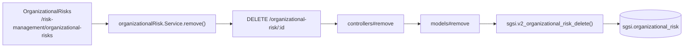

# Eliminar riesgo organizacional

## Propósito
Dar de baja (soft delete) un riesgo organizacional, dejando constancia de una justificación obligatoria.

## Entrada desde UI
Botón de eliminar sobre una fila en `/risk-management/organizational-risks` → diálogo de confirmación con campo de justificación.

## Flujo funcional
1. El usuario ingresa una justificación y confirma.
2. El frontend llama `DELETE /organizational-risk/:id` con la justificación en el body.
3. `sgsi.v2_organizational_risk_delete` marca `deleted_at`, `delete_justification` y `deleted_by`, solo si la fila existe y no estaba ya eliminada.
4. La lista de riesgos eliminados (`GET /organizational-risk/deleted`) queda disponible para consulta (papelera), con el mismo shape que el listado activo más `deletedAt`/`deleteJustification`.

## Frontend
- `OrganizationalRisks` → `useOrganizationalRisk().remove`.

## API
`DELETE /organizational-risk/:id`, `GET /organizational-risk/deleted` — acceso `admin-only`.

## Backend
`routers/organizationalRisk.ts` → `controllers/organizationalRisk.ts#{remove,getDeleted}` → `models/organizationalRisk.ts`.

## Database
`sgsi.v2_organizational_risk_delete` (`funciones_sgsi.sql:22012-22035`): `UPDATE sgsi.organizational_risk SET deleted_at, delete_justification, deleted_by`. Retorna `{success:false}` (no excepción) si no hay filas afectadas. `sgsi.v2_organizational_risk_get_deleted` (`funciones_sgsi.sql:22040-22082`) lee solo filas con `deleted_at IS NOT NULL`.

## Reglas relevantes
- Es soft delete puro — no hay endpoint de restauración documentado ni encontrado en el frontend.

## Consideraciones
- Ninguna adicional — Operación simple, sin convergencia con otras.

## Trazabilidad

