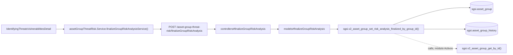

# Finalizar análisis de riesgos de un grupo

## Propósito
Marcar el análisis de amenazas y vulnerabilidades de un grupo de activos como finalizado, dejando constancia en el historial del grupo.

## Entrada desde UI
Botón **"Finalizar análisis"** dentro de `/risk-management/identifying-threats-vulnerabilities/[groupId]` (mismo componente que FLOW-RSK-002).

## Flujo funcional
1. El usuario confirma la finalización desde un diálogo de confirmación.
2. El frontend llama `POST /asset-group-threat-risk/finalizeGroupRiskAnalysis` con `assetGroupId`.
3. `sgsi.v2_asset_group_set_risk_analysis_finalized_by_group_id` marca `sgsi.asset_group.risk_analysis_finalized = true`, inserta un evento en `sgsi.asset_group_history`, y retorna el detalle del grupo llamando a `sgsi.v2_asset_group_get_by_id` (función del módulo Activos).

## Frontend
- `IdentifyingThreatsVulnerabilitiesDetail` → `useAssetGroupRisks(groupId).finalizeRiskAnalysis`.

## API
`POST /asset-group-threat-risk/finalizeGroupRiskAnalysis` — acceso `admin-or-usuario`.

## Backend
`routers/assetGroupThreatRiskRouter.ts` → `controllers/assetGroupThreatRiskController.ts#finalizeGroupRiskAnalysis` → `models/assetGroupThreatRisk.ts#finalizeGroupRiskAnalysis`.

## Database
`sgsi.v2_asset_group_set_risk_analysis_finalized_by_group_id` (`funciones_sgsi.sql:10656-10674`):
- `UPDATE sgsi.asset_group` (`risk_analysis_finalized = true`).
- `INSERT INTO sgsi.asset_group_history` (`action='update'`).
- Retorna vía `sgsi.v2_asset_group_get_by_id` — función del módulo Activos (`docs/06-technical/assets/functions/FN-V2-ASSET-GROUP-GET-BY-ID.yaml`), referenciada por `calls:`, no redocumentada aquí.

## Reglas relevantes
- No hay validación de que existan amenazas evaluadas antes de permitir finalizar — la función no verifica el contenido de `asset_group_threat_risk`, solo actualiza el flag.

## Consideraciones
- El campo que esta Operación actualiza (`sgsi.asset_group.risk_analysis_finalized`) es exactamente el que consume FLOW-RSK-001 para calcular "pendiente" vs. "finalizado" — es la única escritura de Riesgos sobre una tabla propia de Activos.

## Trazabilidad

