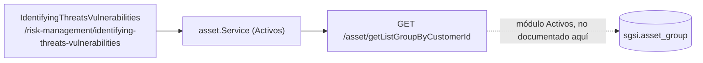

# Consultar grupos pendientes de análisis de amenazas

## Propósito
Mostrar el listado de grupos de activos del cliente, distinguiendo cuáles ya tienen su análisis de amenazas y vulnerabilidades finalizado y cuáles están pendientes, como punto de entrada al análisis de riesgo por grupo.

## Entrada desde UI
Menú **Gestión de Riesgos → Identificación de Amenazas y Vulnerabilidades** → `/risk-management/identifying-threats-vulnerabilities`.

## Flujo funcional
1. Al montar la página, el frontend llama `useAsset().getAssetListGroupByCustomerId()` — el mismo endpoint de listado de grupos del módulo Activos (`GET /asset/getListGroupByCustomerId`, `EP-ASSET-GET-LIST-GROUP`).
2. Sobre esa lista, calcula en el cliente `finalizedCount`/`pendingCount` contando cuántos grupos tienen `group.riskAnalysisFinalized === true`.
3. El filtro de estado ("Pendiente" / "Finalizado") y la búsqueda por nombre/código se resuelven 100% en memoria sobre la lista ya cargada — no hay parámetros de filtro enviados al backend.
4. Al hacer click en un grupo, navega a `/risk-management/identifying-threats-vulnerabilities/[groupId]` (FLOW-RSK-002).

## Frontend
- `IdentifyingThreatsVulnerabilities` → `useAsset().getAssetListGroupByCustomerId`.

## API
`GET /asset/getListGroupByCustomerId` (`EP-ASSET-GET-LIST-GROUP`) — endpoint del módulo Activos, reutilizado tal cual. Riesgos no expone ningún endpoint propio de listado para esta pantalla.

## Backend
Ver `docs/06-technical/assets/endpoints/EP-ASSET-GET-LIST-GROUP.yaml` (módulo Activos) — no se documenta de nuevo aquí.

## Database
`sgsi.asset_group.risk_analysis_finalized` es el único campo de Riesgos involucrado, y se lee (no se escribe) a través del endpoint de Activos. Se actualiza desde FLOW-RSK-004 (Finalizar análisis de riesgos de grupo).

## Reglas relevantes
- "Pendiente" no es un estado propio de Riesgos ni se filtra en el backend — es puramente `!group.riskAnalysisFinalized` evaluado en el cliente sobre la lista completa de grupos.

## Consideraciones
- Esta Operación es un caso límite del estándar: no tiene backend propio, pero tampoco es client-side puro (sí llama a un endpoint real, solo que pertenece a otro módulo). Se documenta con `technical.endpoint` apuntando directamente al ID técnico de Activos (`EP-ASSET-GET-LIST-GROUP`) en vez de `technical: null`, para que la trazabilidad top-down/bottom-up cruzada entre ambos módulos funcione en el Explorer.

## Trazabilidad

