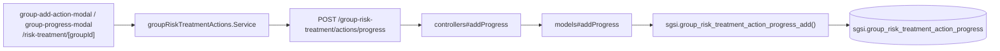

# Gestionar acciones, avance y evidencia de tratamiento por grupo

## Propósito
Definir el plan de mitigación de un escenario de riesgo ya tratado (una o más acciones con responsable y fecha objetivo), y registrar su bitácora de avance con evidencia adjunta.

## Entrada desde UI
Dentro del detalle de un escenario en `/risk-treatment/[groupId]` (o desde la vista consolidada `/risk-treatment` sin drill-down previo, mismo componente) → modal **"Agregar acción"** / tarjeta de acción existente → **"Registrar avance"**.

## Flujo funcional
1. Crear una acción: `POST /group-risk-treatment/actions/upsertAction`. Si es alta y no existe todavía un tratamiento (`group_risk_treatment`) para el escenario, la función lanza `GROUP_RISK_TREATMENT: TREATMENT_NOT_FOUND` — el tratamiento debe existir antes de poder agregarle acciones.
2. Registrar avance: `POST /group-risk-treatment/actions/progress` (multipart, con archivo obligatorio en el cliente) inserta una fila en `group_risk_treatment_action_progress`; el `currentPercentage` de la acción se deriva siempre del último registro de esta bitácora, nunca se almacena en la acción misma.
3. Subir/descargar/eliminar evidencia adicional: `POST/GET/DELETE /group-risk-treatment/actions/:actionId/evidence[/:evidenceId]`, vinculada a la acción y opcionalmente a un registro de progreso puntual.
4. Reglas de bloqueo en PL/pgSQL: una vez que el último progreso registrado llega a 100%, la acción queda `ACTION_LOCKED` (no se puede editar, ni agregar/eliminar evidencia, ni borrar la acción); y no se puede retroceder el porcentaje (`PROGRESS_REGRESSION`) una vez llegado a 100%.

## Frontend
- `GroupTreatmentCard` / `group-add-action-modal` / `group-progress-modal` → `useGroupRiskTreatment().{upsertAction, deleteAction, addProgress, uploadEvidence, getEvidenceDisplayUrl, deleteEvidence}`.

## API
7 endpoints bajo `/group-risk-treatment/actions/*` — acceso `admin-or-usuario`. Los de escritura de progreso/evidencia pasan por middleware `multer` (`uploadEvidenceMiddleware.single("file")`).

## Backend
`routers/groupRiskTreatmentRouter.ts` → `controllers/groupRiskTreatmentController.ts#{getActionList,upsertAction,deleteAction,addProgress,upsertEvidence,getEvidencePath,deleteEvidenceById}` → `models/groupRiskTreatment.ts`.

## Database
7 funciones bajo el prefijo `sgsi.group_risk_treatment_action_*` (`funciones_sgsi.sql:5806-6174`), todas `WRITE`/`READ` sobre `sgsi.group_risk_treatment_action`, `sgsi.group_risk_treatment_action_progress` y `sgsi.group_risk_treatment_action_evidence` — ver YAML individuales en `docs/06-technical/risks/functions/FN-GROUP-RISK-TREATMENT-ACTION-*.yaml`.

## Reglas relevantes
- `RAISE EXCEPTION` con prefijo `GROUP_RISK_TREATMENT:` para: `TARGET_DATE_REQUIRED` (fecha objetivo obligatoria al crear), `TREATMENT_NOT_FOUND` (no se puede agregar acción sin tratamiento previo), `ACTION_LOCKED` (acción ya al 100%), `PROGRESS_REGRESSION` (no se puede retroceder progreso completado).

## Consideraciones
- **Corrección respecto al diseño previamente planteado**: se había asumido una Operación paralela "individual" (`FLOW-RSK-012`, sobre `/risk-treatment/actions/*`). Se confirmó que `useRiskTreatment()` — el hook que expondría esos 7 endpoints — se usa en todo el frontend solo para `strategyList`/`data` de solo lectura (ver FLOW-RSK-010); ninguno de sus métodos de escritura (`upsertAction`, `deleteAction`, `addProgress`, `uploadEvidence`, `deleteEvidence`, `saveAllRiskTreatments`) tiene un llamador real. Esa familia de endpoints queda excluida de las Operaciones de Riesgos — ver `docs/00-catalog/riesgos.md`, "Hallazgos registrados". `FLOW-RSK-012` no existe como archivo.
- Duplicación de patrón (no convergencia técnica) frente a la familia huérfana `risk_treatment_action_*`: mismo shape de 7 endpoints/funciones, sin ninguna relación `calls` entre ambas familias.

## Trazabilidad

