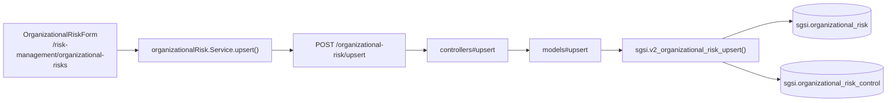

# Crear / editar riesgo organizacional

## Propósito
Registrar riesgos que no están asociados a un activo ni a un grupo (contexto organizacional), con su dominio, escenario, clasificación de confidencialidad, probabilidad/impacto y controles SoA vinculados.

## Entrada desde UI
Menú **Gestión de Riesgos → Riesgos Organizacionales** → `/risk-management/organizational-risks` → botón **"Agregar riesgo"** (o click en uno existente para editar).

## Flujo funcional
1. Al montar la página, se cargan en paralelo el listado (`GET /organizational-risk/list`), el catálogo de escenarios (`GET /organizational-risk/catalog`) y de dominios (`GET /organizational-risk/domains`) para poblar los selects del formulario.
2. El usuario completa `OrganizationalRiskForm`: dominio, escenario, título, confidencialidad, nivel de probabilidad/impacto y controles SoA aplicables.
3. Al guardar, llama `POST /organizational-risk/upsert` con `id` presente (editar) o ausente (crear).
4. `sgsi.v2_organizational_risk_upsert` hace `INSERT` o `UPDATE` sobre `sgsi.organizational_risk`; si es edición, **borra todos** los controles vinculados (`DELETE FROM organizational_risk_control`) y reinserta el set completo recibido.

## Frontend
- `OrganizationalRisks` → `useOrganizationalRisk().{upsert, getList, getCatalog, getDomains}` → `OrganizationalRiskForm`.

## API
`GET /organizational-risk/{list,catalog,domains}`, `POST /organizational-risk/upsert` — acceso `admin-only` (único módulo de Riesgos sin acceso `admin-or-usuario`).

## Backend
`routers/organizationalRisk.ts` → `controllers/organizationalRisk.ts` → `models/organizationalRisk.ts` → `queries/organizationalRisk.ts`.

## Database
`sgsi.v2_organizational_risk_upsert` (`funciones_sgsi.sql:22133-22181`):
- `INSERT`/`UPDATE` sobre `sgsi.organizational_risk`.
- `DELETE` + `INSERT` completo sobre `sgsi.organizational_risk_control` (reemplazo total del set de controles, no incremental).

## Reglas relevantes
- Al editar, si el `UPDATE` no afecta ninguna fila (riesgo no encontrado), retorna `{success:false}` sin lanzar excepción.
- El reemplazo completo de controles en cada edición sigue el mismo patrón "DELETE+INSERT" que `sgsi.v2_group_risk_treatment_upsert` (FLOW-RSK-010/011) — sin protección contra condiciones de carrera si dos ediciones concurrentes tocan el mismo riesgo.

## Consideraciones
- **Convergencia con Tratamiento**: un riesgo organizacional creado aquí es uno de los dos orígenes posibles que resuelve `sgsi.v2_group_risk_treatment_get_list`/`sgsi.v2_risk_matrix_get` — junto con los riesgos de activo, aparece en la Matriz de Riesgo (FLOW-RSK-005) y puede recibir tratamiento (vía `risk_treatment.organizational_risk_id`), aunque el tratamiento organizacional no tiene una Operación propia documentada en este pase (no se encontró una UI de definición de tratamiento específica para riesgos organizacionales fuera de la Matriz).

## Trazabilidad

