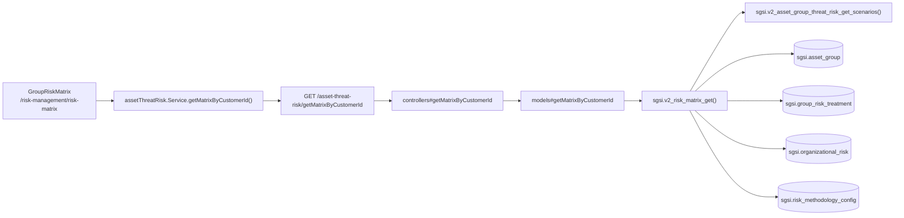

# Consultar matriz de riesgo

## Propósito
Visualizar la matriz de riesgo (4x4 y equivalente 3x3) del cliente, combinando riesgos analizados por grupo de activos y riesgos organizacionales, con el apetito de riesgo configurado.

## Entrada desde UI
Menú **Gestión de Riesgos → Matriz de Riesgo** → `/risk-management/risk-matrix`.

## Flujo funcional
1. Al montar la página, `group-risk-matrix.tsx` llama `useAssetThreatRisk().getMatrixByCustomerId()` → `GET /asset-threat-risk/getMatrixByCustomerId`.
2. `sgsi.v2_risk_matrix_get` calcula, en una sola función, dos orígenes de riesgo combinados con `UNION ALL`: (1) riesgos por **grupo de activos** (`sgsi.asset_group`, vía `sgsi.v2_asset_group_threat_risk_get_scenarios` — el mismo origen que alimenta FLOW-RSK-002), (2) riesgos **organizacionales** (`sgsi.organizational_risk`).
3. Para cada riesgo calcula bucket 4x4 (impacto/probabilidad, niveles 1-4) y 3x3 (agrupado), nivel residual si existe tratamiento (`sgsi.group_risk_treatment` para la rama de grupo, `sgsi.risk_treatment` para la organizacional), y el top de "riesgos críticos" (`inherent_risk_value >= apetito`).
4. Si el cliente configuró metodología (`sgsi.risk_methodology_config`), la matriz usa su apetito y zonas; si no, usa valores por defecto embebidos en la función.
5. El resultado alimenta la grilla 4x4, el drawer de críticos, y el configurador de metodología embebido (ver FLOW-RSK-006).

## Frontend
- `GroupRiskMatrix` → `useAssetThreatRisk().{matrixData, getMatrixByCustomerId}`.

## API
`GET /asset-threat-risk/getMatrixByCustomerId` — acceso `admin-only`.

## Backend
`routers/assetThreatRisk.ts` → `controllers/assetThreatRisk.ts#getMatrixByCustomerId` → `models/assetThreatRisk.ts#getMatrixByCustomerId`.

## Database
`sgsi.v2_risk_matrix_get` (`funciones_sgsi.sql:23908-24210`) — función pura de lectura, sin escrituras:
- Rama 1 "asset" (por grupo): `sgsi.asset_group` `CROSS JOIN LATERAL` `sgsi.v2_asset_group_threat_risk_get_scenarios(ag.id)` + `sgsi.probability_impact_level` + `sgsi.group_risk_treatment` (residual).
- Rama 2 "organizational": `sgsi.organizational_risk` + `sgsi.risk_scenario_catalog` + `sgsi.probability_impact_level` + `sgsi.risk_treatment` (residual).
- Metodología: `sgsi.risk_methodology_config`.

## Reglas relevantes
- `matrix5x5` en la respuesta es un alias idéntico a `matrix4x4` ("retrocompatibilidad", según el propio comentario de la función) — no hay dos matrices distintas; el modelo real es 4x4 (Sprint 5, ME-007).

## Consideraciones
- **Corrección (2026-09-08)**: hasta la migración `api-sgsi/sql/sgsi/migrations/sprint5/5_2026-09-07_me007_risk_matrix_4x4_functions.sql`, la rama 1 de esta función leía por error `sgsi.asset_threat_risk`/`sgsi.asset` (modelo legado por activo individual, con endpoints de escritura huérfanos) en vez de por grupo — el propio comentario de la migración documenta esa regresión y su corrección. Ya aplicada y confirmada contra `funciones_sgsi.sql` sincronizado desde la BD: la matriz ahora sí refleja el trabajo de FLOW-RSK-002.
- `RiskMethodologyConfigurator` (FLOW-RSK-006) se renderiza embebido en esta misma pantalla, usando `matrixData.methodology` como valor inicial.

## Trazabilidad

