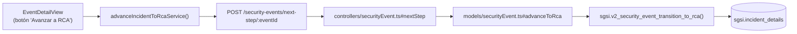

# Avanzar a Fase de Causa Raíz

## Propósito
Transicionar un incidente desde `in_investigation` a `in_rca`, indicando que la fase de recopilación de datos ha finalizado y la investigación procede al análisis de causa raíz.

## Entrada desde UI
Evento en estado `in_investigation` → Tab **"RCA"** → Botón **"Avanzar a Causa Raíz"**.

## Flujo funcional
1. Usuario confirma intención de avanzar a RCA (puede haber check: "¿Todos los hallazgos registrados?").
2. Frontend envía `POST /security-events/next-step/:eventId` con header/body especificando `target: "rca"` o similar.
3. Backend valida:
   - Evento está en estado `in_investigation`.
   - Usuario es investigador o revisor.
4. `sgsi.v2_security_event_transition_to_rca()` ejecuta: UPDATE status → `in_rca`.
5. UI refleja cambio: Tab RCA se activa, investigación se cierra; interfaz cambia a modo RCA.

## Frontend
- Botón integrado en `EventDetailView`.
- Confirmación modal simple ("¿Proceder a RCA?").
- `useSecurityEvent().advanceIncidentToRca()` → `securityEvent.Service.advanceIncidentToRcaService()`.

## API
`POST /security-events/next-step/:eventId` — body: `{step: "rca"}` o implícito.

Acceso restringido a investigador/revisor.

## Backend
`routers/securityEvent.ts` → `controllers/securityEvent.ts#nextStep` → `models/securityEvent.ts#advanceToRca` → `queries/securityEvent.ts _transition_to_rca`.

## Database
`sgsi.v2_security_event_transition_to_rca(p_event_id, p_customer_id)` (funciones_sgsi.sql):
- Valida estado actual = `in_investigation`.
- UPDATE `sgsi.incident_details` status → `in_rca`.

## Reglas relevantes
- Transición es **EXPLÍCITA**, no automática.
- Solo desde `in_investigation`; sin saltos de estado.
- No hay validación de "hallazgos mínimos obligatorios" (no se fuerza).

## Consideraciones
- Operación **puramente transicional**: no crea/modifica datos de negocio, solo cambia máquina de estados.
- Puede ser reversible operacionalmente (no documentado, pero técnicamente posible vía base de datos).

## Trazabilidad

