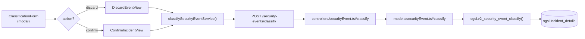

# Clasificar Evento (Descartar o Confirmar Incidente)

## Propósito
Tomar decisión binaria sobre un evento reportado: descartar si es falsa alarma o confirmar como incidente formal para investigación.

## Entrada desde UI
Evento en estado `pending_classification` → botón **"Clasificar"** en tabla de listado → modal `ClassificationForm` que presenta dos opciones: **Descartar** o **Confirmar como Incidente**.

## Flujo funcional
1. Modal abre con detalle reducido del evento.
2. Usuario elige:
   - **Descartar**: ingresa justificación breve, envía.
   - **Confirmar**: selecciona severidad, asigna investigador/revisor/controlador, define SLAs, envía.
3. Frontend arma payload con `action` ("discard" | "confirm") y datos correspondientes.
4. `POST /security-events/classify` → Backend valida roles/permisos.
5. `sgsi.v2_security_event_classify` procesa:
   - Si `action="discard"`: UPDATE estado → `discarded` (TERMINAL), registra justificación.
   - Si `action="confirm"`: UPDATE estado → `incident_confirmed`, asigna roles, registra metadata de clasificación.
6. Tras procesamiento, notificación al investigador asignado (si confirmar).

## Frontend
- `ClassificationForm` renderiza condicionalmente `DiscardEventView` o `ConfirmIncidentView`.
- `ConfirmIncidentView` usa `usePerson()` hook para lookup de investigadores/revisores/controladores disponibles.
- `useSecurityEvent().classifyEvent()` → `securityEventStore` → `securityEvent.Service.classifySecurityEventService()`.

## API
`POST /security-events/classify` — acceso por rol investigador/revisor/controlador.

## Backend
`routers/securityEvent.ts` → `controllers/securityEvent.ts#classify` → `models/securityEvent.ts#classify` → `queries/securityEvent.ts _classify`.

## Database
`sgsi.v2_security_event_classify` (funciones_sgsi.sql):
- Valida estado actual = `pending_classification`.
- Si `action="discard"`: UPDATE status → `discarded`, registra `justification_discard`.
- Si `action="confirm"`: UPDATE status → `incident_confirmed`, registra roles asignados (`incidentInvestigatorId`, `incidentReviewerId`, `incidentControllerId`), metadata.
- Retorna evento actualizado.

## Reglas relevantes
- Solo eventos en `pending_classification` pueden clasificarse.
- Descartar es TERMINAL: no se puede revertir.
- Confirmar requiere al menos un investigador; revisor/controlador opcionales inicialmente.
- Investigador/revisor/controlador deben pertenecer al mismo cliente.

## Consideraciones
- **Una operación, dos bifurcaciones**: Técnicamente, "Descartar" y "Confirmar" son dos ramas del mismo endpoint (determinadas por parámetro `action`), no operaciones separadas. La lógica es distinta pero la intención funcional es única: "decidir sobre evento".
- La notificación al investigador es efecto secundario, dispara en background.

## Trazabilidad

