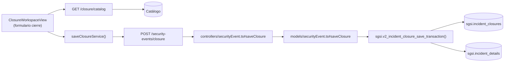

# Cerrar Incidente

## Propósito
Cerrar formalmente un incidente de seguridad tras validación exitosa y monitoreo satisfactorio, registrando decisión de cierre, lecciones aprendidas y marcando como resoluto.

## Entrada desde UI
Evento en estado `pending_effectiveness` o `monitoring_effectiveness` → Botón **"Cerrar Incidente"** → Formulario modal → Confirmar.

## Flujo funcional
1. Usuario (revisor) accede a formulario de cierre.
2. Selecciona tipo de cierre (desde catálogo: "Resuelto", "Aceptado", "Pospuesto", etc.).
3. Ingresa comentarios finales, lecciones aprendidas, recomendaciones.
4. Envía `POST /security-events/closure` con decisión y detalles.
5. Backend valida:
   - Evento en estado `pending_effectiveness` o `monitoring_effectiveness`.
   - Usuario es revisor asignado (validación `validateClosurePermission()`).
6. `sgsi.v2_incident_closure_save_transaction()` ejecuta transacción:
   - INSERT `sgsi.incident_closures` — registro de cierre.
   - UPDATE `sgsi.incident_details` status → `closed` (TERMINAL).
7. Evento marcado como cerrado, desaparece de bandeja activa, archivo inmovilizado.

## Frontend
- `ClosureWorkspaceView` — formulario de cierre.
- Fetch de catálogo de decisiones de cierre: `GET /security-events/closure/catalog`.
- Confirmación final antes de enviar.
- `useSecurityEvent().saveClosure()` → `securityEventStore` → `securityEvent.Service.saveClosureService()`.

## API
- `POST /security-events/closure` — body: `{eventId, decision_id, closure_comments, final_lessons_learned, ...}`
- `GET /security-events/closure/catalog` — catálogo (no es FLOW)

Acceso restringido a revisor.

## Backend
`routers/securityEvent.ts` → `controllers/securityEvent.ts#saveClosure` (con middleware `validateClosurePermission()`) → `models/securityEvent.ts#saveClosure` → `queries/securityEvent.ts _saveClosureTransaction`.

## Database
`sgsi.v2_incident_closure_save_transaction(p_incident_id, p_decision_id, p_committee_session, p_closure_comments, p_final_lessons_learned, p_closed_by_user_id, p_customer_id)` (funciones_sgsi.sql):
- INSERT `sgsi.incident_closures` — registro de cierre con decisión, comentarios, lecciones.
- UPDATE `sgsi.incident_details` status → `closed`.
- Transacción ACID: ambos cambios o ninguno.

## Reglas relevantes
- Cierre es **TERMINAL**: no hay reapertura.
- Solo revisor asignado puede cerrar.
- Evento debe estar en `pending_effectiveness` o `monitoring_effectiveness` (precondición).
- Decisión de cierre es obligatoria.

## Consideraciones
- Operación **transicional final**: no hay más cambios post-cierre en máquina de estados.
- Si se requiere reapertura en futuro: crear nuevo incidente (no reabrir).
- Transacción asegura atomicidad: no quedar en estado inconsistente.

## Trazabilidad

