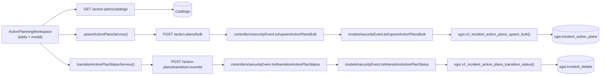

# Gestionar Plan de Acciones Correctivas

## Propósito
Definir, registrar y gestionar las acciones correctivas necesarias para remediar el incidente, incluyendo responsables, fechas de compromiso y evidencia de cumplimiento.

## Entrada desde UI
Evento en estado `in_rca` o `action_planning` → Tab **"Acciones"** → Botón **"Crear Acción"** o tabla de acciones existentes.

## Flujo funcional
1. Usuario define una o más acciones correctivas en formulario modal/inline:
   - Descripción de acción.
   - Tipo de acción (desde catálogo).
   - Responsable (asignado).
   - Fecha de compromiso.
   - Evidencia de verificación (método).
2. Frontend envía `POST /security-events/action-plans/bulk` con array de acciones.
3. Backend valida:
   - Evento en estado `in_rca` o `action_planning`.
   - Responsables son usuarios válidos del cliente.
4. `sgsi.v2_incident_action_plans_upsert_bulk()` registra: INSERT bulk en `sgsi.incident_action_plans`.
5. Acciones aparecen en tabla del Tab Acciones.
6. Usuario puede transicionar estado de acciones (completar): `POST /security-events/action-plans/transition/:eventId` → `sgsi.v2_incident_action_plans_transition_status()` → estado → `pending_validation`.

## Frontend
- `ActionPlanningWorkspace` — tabla + formulario modal para crear/editar.
- Fetch de catálogo de tipos de acción: `GET /security-events/action-plans/catalogs`.
- `useSecurityEvent().upsertActionPlans()` → `securityEventStore` → `securityEvent.Service.upsertActionPlansService()`.

## API
- `POST /security-events/action-plans/bulk` — body: array de acciones
- `POST /security-events/action-plans/transition/:eventId` — transiciona evento a `pending_validation`
- `GET /security-events/action-plans/catalogs` — catálogo (no es FLOW)

Acceso restringido a investigador/revisor.

## Backend
`routers/securityEvent.ts` → `controllers/securityEvent.ts#upsertActionPlansBulk / transitionActionPlanStatus` → `models/securityEvent.ts` → `queries/securityEvent.ts`.

## Database
- `sgsi.v2_incident_action_plans_upsert_bulk(p_incident_id, p_action_plans_json)` — INSERT bulk.
- `sgsi.v2_incident_action_plans_transition_status(p_incident_id, p_customer_id)` — UPDATE evento status → `pending_validation`.

## Reglas relevantes
- Acciones son obligatorias; no se puede validar sin ellas.
- Responsable debe ser usuario del cliente.
- Fecha de compromiso es obligatoria y debe ser futuro.
- Transición a `pending_validation` solo posible si hay acciones registradas.

## Consideraciones
- Operación **incluye creación de datos (acciones) y transición de estado** — es compuesta pero intención única.
- CRUD individual de acciones (editar/eliminar una específica) no está documentado como FLOW (son detalles de UX, no operación funcional superior).

## Trazabilidad

