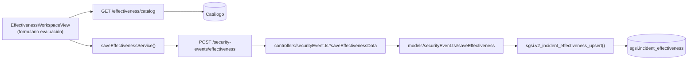

# Monitorear Efectividad Post-Cierre

## Propósito
Documentar evaluaciones periódicas de la efectividad de las acciones correctivas en el tiempo, para asegurar que el incidente no recurrirá. Operación repetible durante período de monitoreo.

## Entrada desde UI
Evento en estado `pending_effectiveness` o `monitoring_effectiveness` → Tab **"Efectividad"** → Botón **"Registrar Evaluación"** → Formulario → Guardar.

## Flujo funcional
1. Usuario selecciona período de observación (weekly, monthly, quarterly, etc.) desde catálogo.
2. Ingresa fecha de evaluación, métricas observadas, comentarios de eficacia.
3. Evalúa: "¿Se ha detectado recurrencia?" (sí/no/parcial).
4. Envía `POST /security-events/effectiveness` con payload de evaluación.
5. Backend valida:
   - Evento en estado `pending_effectiveness` o `monitoring_effectiveness`.
   - Usuario es investigador/revisor.
6. `sgsi.v2_incident_effectiveness_upsert()` registra: INSERT o UPDATE `sgsi.incident_effectiveness` (UPSERT pattern; puede haber múltiples evaluaciones).
7. Evaluación aparece en timeline del Tab Efectividad.
8. Permanece en `monitoring_effectiveness` hasta cierre final o período vencido.

## Frontend
- `EffectivenessWorkspaceView` — formulario de evaluación + timeline de evaluaciones previas.
- Fetch de catálogo de períodos de observación: `GET /security-events/effectiveness/catalog`.
- `useSecurityEvent().saveEffectiveness()` → `securityEventStore` → `securityEvent.Service.saveEffectivenessService()`.

## API
- `POST /security-events/effectiveness` — body: `{eventId, observation_period_id, evaluation_date, recurrence_detected, comments, ...}`
- `GET /security-events/effectiveness/catalog` — catálogo (no es FLOW)

Acceso restringido a investigador/revisor.

## Backend
`routers/securityEvent.ts` → `controllers/securityEvent.ts#saveEffectivenessData` → `models/securityEvent.ts#saveEffectiveness` → `queries/securityEvent.ts _upsertEffectiveness`.

## Database
`sgsi.v2_incident_effectiveness_upsert(p_incident_id, p_observation_period_id, p_evaluation_date, p_recurrence_detected, p_lessons_learned, ...)` (funciones_sgsi.sql):
- INSERT o UPDATE `sgsi.incident_effectiveness`.
- Permite múltiples evaluaciones en el mismo período de monitoreo.

## Reglas relevantes
- Operación **repetible**: puede ejecutarse N veces en el mismo período.
- No transiciona estado automáticamente (permanece en `monitoring_effectiveness`).
- Período de observación es obligatorio.
- Si se detecta recurrencia: puede disparar escalamiento (no documentado aquí; posible hallazgo).

## Consideraciones
- **Operación singular pero iterativa**: Es una sola Operación, pero se ejecuta múltiples veces (UPSERT pattern). No confundir con múltiples operaciones.
- La fecha de evaluación puede ser pasada (retrospectiva).

## Trazabilidad

