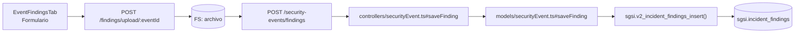

# Registrar Hallazgos de Investigación

## Propósito
Documentar hallazgos técnicos y no técnicos descubiertos durante la investigación de un incidente de seguridad, con capacidad de adjuntar evidencia.

## Entrada desde UI
Evento en estado `in_investigation` o posterior → Tab **"Hallazgos"** → Botón **"Agregar hallazgo"** → Formulario modal.

## Flujo funcional
1. Formulario recibe descripción del hallazgo (texto enriquecido), severidad opcional, categoría de hallazgo.
2. Usuario puede adjuntar archivo (evidencia: logs, capturas, reportes, etc.).
3. Si adjunta archivo:
   - Carga vía `POST /security-events/findings/upload/:eventId` (multipart).
   - Archivo se persiste en FS; retorna `fileId` (UUID).
4. Frontend envía `POST /security-events/findings` con `{ eventId, description, fileId, ...}`.
5. Backend valida:
   - Evento existe y pertenece al cliente.
   - Usuario es investigador asignado (validación `validateInvestigationPermission()`).
6. `sgsi.v2_incident_findings_insert()` registra hallazgo: INSERT `sgsi.incident_findings` con FK a evento.
7. Hallazgo aparece en timeline del Tab Hallazgos.

## Frontend
- `EventFindingsTab` renderiza timeline de hallazgos existentes + botón de agregar.
- Modal de ingreso con validación básica (descripción obligatoria).
- Upload de archivo vía middleware estándar.
- `useSecurityEvent().saveFinding()` → `securityEventStore` → `securityEvent.Service.saveIncidentFindingService()`.

## API
- `POST /security-events/findings` — body: `{eventId, description, fileId}`
- `POST /security-events/findings/upload/:eventId` — multipart: archivo

Acceso restringido a investigador asignado.

## Backend
`routers/securityEvent.ts` → `controllers/securityEvent.ts#saveFinding` (con `validateInvestigationPermission()`) → `models/securityEvent.ts#saveFinding` → `queries/securityEvent.ts _insertFinding`.

## Database
`sgsi.v2_incident_findings_insert(p_event_id, p_description, p_file_id, p_user_id)` (funciones_sgsi.sql):
- INSERT INTO `sgsi.incident_findings`.
- Registra timestamp, usuario investigador, relación a evento.

## Reglas relevantes
- Hallazgos solo pueden ser registrados por investigador asignado.
- No hay eliminación de hallazgos (audit trail); si es erróneo, crear uno nuevo de corrección.
- Archivo es opcional; descripción es requerida.

## Consideraciones
- Operación es **independiente de transiciones de estado**: no avanza máquina de estados. Es registro paralelo que ocurre durante `in_investigation`.
- Puede registrarse múltiples hallazgos en el mismo evento.

## Trazabilidad

