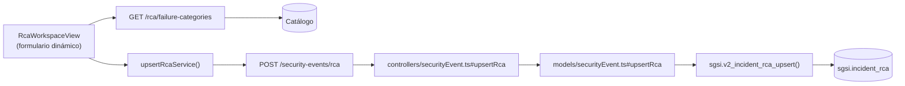

# Registrar Análisis de Causa Raíz

## Propósito
Documentar el análisis de causa raíz de un incidente usando la metodología seleccionada (5 Porqués, Ishikawa, Brainstorming), incluyendo categorización de fallo.

## Entrada desde UI
Evento en estado `in_rca` → Tab **"RCA"** → Seleccionar metodología → Completar formulario → Guardar.

## Flujo funcional
1. Usuario elige metodología RCA (5 Porqués, Ishikawa, Brainstorming).
2. Formulario adapta estructura según metodología:
   - 5 Porqués: 5 campos anidados de preguntas/respuestas.
   - Ishikawa: 6 categorías (personas, máquina, método, material, entorno, medición).
   - Brainstorming: lista libre de observaciones.
3. Usuario ingresa detalles, selecciona categoría de fallo (dropdown: catálogo).
4. Envía `POST /security-events/rca` con payload JSON de análisis.
5. Backend valida evento en `in_rca`.
6. `sgsi.v2_incident_rca_upsert()` registra: INSERT o UPDATE `sgsi.incident_rca` según presencia de ID previo.
7. RCA guardado, aparece en timeline del Tab RCA.

## Frontend
- `RcaWorkspaceView` — componente que renderiza formulario dinámico según metodología.
- Fetch de catálogo de failure_categories vía `GET /security-events/rca/failure-categories`.
- `useSecurityEvent().upsertRca()` → `securityEventStore` → `securityEvent.Service.upsertRcaService()`.

## API
- `POST /security-events/rca` — body: `{eventId, methodology_type, methodology_details, failure_category_id}`
- `GET /security-events/rca/failure-categories` — catálogo (no es FLOW)

Acceso restringido a investigador.

## Backend
`routers/securityEvent.ts` → `controllers/securityEvent.ts#upsertRca` → `models/securityEvent.ts#upsertRca` → `queries/securityEvent.ts _upsertRca`.

## Database
`sgsi.v2_incident_rca_upsert(p_event_id, p_customer_id, p_user_id, p_methodology_type, p_methodology_details, p_failure_category_id)` (funciones_sgsi.sql):
- INSERT o UPDATE `sgsi.incident_rca`.
- Registra metodología elegida, detalles completos (JSONB), categoría de fallo.

## Reglas relevantes
- RCA solo puede guardarse en estado `in_rca`.
- Metodología es obligatoria; detalles se validan según tipo.
- Puede editarse (UPSERT pattern) mientras se esté en fase RCA.
- Categoría de fallo es obligatoria.

## Consideraciones
- Operación **NO transiciona estado**: mantiene `in_rca`. Transición a siguiente fase es acción separada (FLOW-SEC-006 u otro endpoint).
- RCA puede guardarse múltiples veces (iterativo) sin cambiar máquina de estados.
- La estructura de `methodology_details` es flexible (JSONB) y depende del tipo seleccionado.

## Trazabilidad

