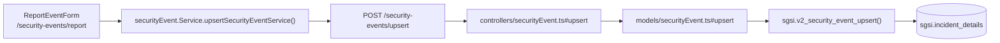

# Reportar o Actualizar Evento de Seguridad

## Propósito
Registrar un nuevo evento de seguridad en el sistema o actualizar uno pendiente de clasificación, capturando detalles técnicos, impacto, evidencia e información del origen del evento.

## Entrada desde UI
`/security-events/report` — formulario inicial sin precondiciones de estado. Acceso abierto a investigadores/revisores/controladores.

## Flujo funcional
1. El usuario accede a `/security-events/report` (nuevo evento) y completa el formulario (`ReportEventForm`): resumen, fecha, ubicación del evento, detalles técnicos, impacto, nivel de severidad inicial, evidencia opcional.
2. Validación frontend (Zod): todos los campos requeridos presentes, formatos correctos.
3. Al enviar, el frontend arma el payload **con o sin `id`** y llama `POST /security-events/upsert`.
4. Backend valida contra esquema Joi.
5. `sgsi.v2_security_event_upsert` detecta presencia/ausencia de `id`:
   - Sin `id` → rama INSERT: nuevo evento, estado `pending_classification`, generación de código/UUID.
   - Con `id` → rama UPDATE: solo si está en estado `pending_classification`, permite edición pre-clasificación.
6. Evento retorna en estado `pending_classification`, visible en tab "Inbox" de listado.

## Frontend
- `ReportEventForm` — componente funcional con validación Zod.
- `useSecurityEvent().upsertEvent()` → `securityEventStore` → `securityEvent.Service.upsertSecurityEventService()`.

## API
`POST /security-events/upsert` — acceso por rol de investigador/revisor/controlador.

## Backend
`routers/securityEvent.ts` → `controllers/securityEvent.ts#upsert` (Joi) → `models/securityEvent.ts#upsert` → `queries/securityEvent.ts _upsert`.

## Database
`sgsi.v2_security_event_upsert` (funciones_sgsi.sql):
- `INSERT INTO sgsi.incident_details` si es nuevo.
- `UPDATE sgsi.incident_details` si ya existe y está en `pending_classification`.
- Retorna evento completo vía `sgsi.v2_security_event_get_by_id()`.

## Reglas relevantes
- No se permite crear un evento con estado distinto de `pending_classification`.
- La edición pre-clasificación es posible; post-clasificación requiere operaciones especializadas.
- Campo `originKpiId` es opcional; si se proporciona, debe existir en dominio de KPI.

## Consideraciones
- **Convergencia técnica**: Este mismo endpoint (`EP-SECURITY-EVENT-UPSERT`) es también usado por usuarios que desean reeditar un evento pendiente de clasificación (misma función, diferente entrada UI: desde detalle vs. desde formulario limpio).
- La operación es UPSERT: el usuario no precisa saber si crea o actualiza.

## Trazabilidad

