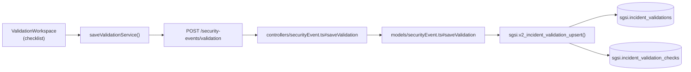

# Validar Efectividad de Acciones

## Propósito
Verificar que las acciones correctivas ejecutadas fueron efectivas en remediar la causa raíz del incidente, mediante un checklist de validación.

## Entrada desde UI
Evento en estado `pending_validation` → Tab **"Validación"** → Formulario de checklist de validación → Enviar.

## Flujo funcional
1. Sistema presenta checklist de validación (items derivados de acciones o estándar del cliente).
2. Usuario verifica cada item:
   - ¿Se ejecutó la acción?
   - ¿Se verificó correctamente?
   - ¿Hay evidencia?
3. Usuario ingresa comentarios finales y marca como "Validado" o "No validado".
4. Envía `POST /security-events/validation` con resultados del checklist.
5. Backend valida:
   - Evento en estado `pending_validation`.
   - Usuario es revisor asignado.
6. `sgsi.v2_incident_validation_upsert()` registra: INSERT `sgsi.incident_validations` + rows en `sgsi.incident_validation_checks`.
7. Si validación es satisfactoria: transición automática o manual a `pending_effectiveness` (verificar lógica backend).

## Frontend
- `ValidationWorkspace` — lista de items de checklist + campos de validación (sí/no/comentario).
- Validación simple: al menos un item debe tener respuesta.
- `useSecurityEvent().saveValidation()` → `securityEventStore` → `securityEvent.Service.saveValidationService()`.

## API
`POST /security-events/validation` — body: `{eventId, validation_items: [{item_id, result, comments}], ...}`

Acceso restringido a revisor.

## Backend
`routers/securityEvent.ts` → `controllers/securityEvent.ts#saveValidation` → `models/securityEvent.ts#saveValidation` → `queries/securityEvent.ts _upsertValidation`.

## Database
`sgsi.v2_incident_validation_upsert(p_incident_id, p_checklist_items, p_validation_comments, ...)` (funciones_sgsi.sql):
- INSERT `sgsi.incident_validations` — registro de validación.
- INSERT bulk `sgsi.incident_validation_checks` — items del checklist con resultados.

## Reglas relevantes
- Validación solo posible en estado `pending_validation`.
- Revisor es rol requerido.
- Puede haber múltiples intentos de validación (reutilización de UPSERT).
- No se valida automáticamente; requiere acción explícita del revisor.

## Consideraciones
- Operación **NO transiciona estado directamente** (depende de lógica de negocio: validación satisfactoria → avance automático o manual).
- Puede ser rechazada/repetida (no es decisión terminal como cierre).

## Trazabilidad

