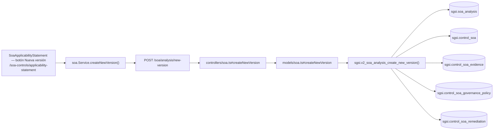

# Crear nueva versión de Declaración SoA

## Propósito
Cerrar la versión activa de la Declaración de Aplicabilidad y abrir una nueva versión (V+1), clonando todas las evaluaciones, evidencia, remediación y políticas de gobernanza de la versión anterior como punto de partida editable.

## Entrada desde UI
`/soa-controls/applicability-statement` → botón **"Nueva versión"** → diálogo de confirmación (`onConfirmNewVersion`).

## Flujo funcional
1. El usuario confirma la creación de una nueva versión.
2. `createNewSoaVersion` → `EP-SOA-ANALYSIS-NEW-VERSION` → `sgsi.v2_soa_analysis_create_new_version`.
3. La función desactiva la versión activa actual (`is_active=false`), crea una nueva cabecera `V+1` (`is_active=true`, `is_complete=false`), y clona en bloque las evaluaciones (`control_soa`), evidencia (`control_soa_evidence`), políticas de gobernanza (`control_soa_governance_policy`) y remediación (`control_soa_remediation`) de la versión anterior hacia la nueva.
4. El frontend refresca la cabecera (`getSoaAnalysis`) y el historial de versiones (`getSoaVersions`).

## Frontend
- `SoaApplicabilityStatement` → `onConfirmNewVersion` → `useSoa().createNewSoaVersion`.

## API
`POST /soa/analysis/new-version` — acceso `admin-only`.

## Backend
`routers/soa.ts:41` → `controllers/soa.ts#createNewVersion` → `models/soa.ts#createNewVersion` → `queries/soa.ts _createNewVersion`.

## Database
`sgsi.v2_soa_analysis_create_new_version` (`funciones_sgsi.sql:26440-26591`):
- Si no hay versión activa, retorna `success:false` sin crear nada.
- `UPDATE sgsi.soa_analysis SET is_active=false` sobre la versión anterior.
- `INSERT INTO sgsi.soa_analysis` — nueva cabecera `version = anterior+1`, título autogenerado `"Declaración SOA V<n>"`.
- Clona por `SELECT ... INSERT` (join por `id_base_control_clause` entre versión vieja y nueva) las evaluaciones de `sgsi.control_soa`, y luego, ya con los IDs nuevos de `control_soa`, clona `sgsi.control_soa_evidence`, `sgsi.control_soa_governance_policy` y `sgsi.control_soa_remediation`.

## Reglas relevantes
- No se puede crear una nueva versión si no existe ninguna versión activa (caso borde protegido explícitamente en la función, retorna `success:false`).
- El clonado es completo — no hay opción de crear una versión "en blanco"; siempre parte de una copia de la versión anterior.
- Solo existe una versión activa (`is_active=true`) por cliente en todo momento — la creación de una nueva versión es atómica con la desactivación de la anterior dentro de la misma función.

## Consideraciones
- Sin convergencia con otras Operaciones — endpoint y función exclusivos de esta acción.
- El clonado no incluye la versión completa como snapshot separado si luego se sigue editando la versión anterior (que ya quedó `is_active=false`, por lo que deja de ser editable desde la pantalla principal) — el histórico completo se consulta desde FLOW-SOA-004.

## Trazabilidad

