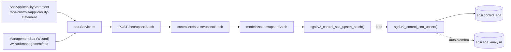

# Evaluar y guardar Declaración SoA

## Propósito
Evaluar la aplicabilidad de los 93 controles ISO del catálogo para el cliente, con justificación, motivos (legal/contractual/negocio/evaluación de riesgo), evidencia adjunta, plan de remediación cuando corresponde, y políticas de gobernanza vinculadas — como borrador incremental dentro de la Declaración de Aplicabilidad (SOA) activa.

## Entrada desde UI
- `/soa-controls/applicability-statement` — pantalla principal del módulo "Controles y SoA".
- `/wizard/management/soa` — mismo formulario, embebido como paso del Wizard de onboarding (`ManagementSoa`).

Ambas rutas son puntos de entrada de la **misma Operación**: comparten el mismo hook (`useSoa()`), el mismo store (`soaStore.ts`) y los mismos endpoints — no hay ningún parámetro de "instancia de wizard" que separe los datos; el `customerId` se resuelve siempre server-side desde la sesión. Ver Consideraciones.

## Flujo funcional
1. Al entrar, la pantalla carga el catálogo completo de 93 controles (`getSoaAllControls` → `EP-SOA-GET-ALL-CONTROLS`) y la cabecera de la Declaración activa (`getSoaAnalysis` → `EP-SOA-ANALYSIS-GET`). Si no existe ninguna Declaración activa para el cliente, la función de base de datos la auto-siembra (ver `FN-V2-SOA-ANALYSIS-GET-ACTIVE`).
2. El usuario evalúa uno o más controles: marca si aplica, justificación, motivos, política asociada, gobernanza. Puede pedir sugerencias de aplicabilidad según el contexto del cliente (`getSuggestedControls` → `EP-SOA-SUGGESTED-CONTROLS`, combina reglas del cuestionario Wizard con sugerencias de IA).
3. Al guardar (borrador incremental o guardado completo), el frontend envía el o los controles modificados a `upsertSoaBatch` → `EP-SOA-UPSERT-BATCH`, que internamente hace upsert fila por fila (incluso para un solo control).
4. Evidencia: subir archivo (`EP-SOA-EVIDENCE-UPLOAD`) y luego registrar el vínculo control↔evidencia (`EP-SOA-EVIDENCE-UPSERT`); eliminar evidencia (`EP-SOA-EVIDENCE-DELETE` — ver hallazgo de seguridad en el catálogo del módulo).
5. Remediación: si el control no está implementado, se puede definir una acción de remediación (`EP-SOA-REMEDIATION-UPSERT`, reemplaza la remediación anterior del control).
6. Políticas de gobernanza: seleccionar documentos tipo "Política" del catálogo de Documentos y guardarlos por alcance (`EP-SOA-GOVERNANCE-POLICIES-UPSERT`, reemplaza el set completo del alcance).

## Frontend
- `SoaApplicabilityStatement` (pantalla principal) y `ManagementSoa` (Wizard) → ambos consumen `useSoa()` directamente, sin componente intermedio compartido.
- `useSoa()` → `soaStore` → `soa.Service.ts`.

## API
`GET /soa/getAllControls`, `GET /soa/analysis`, `POST /soa/upsertBatch`, `GET /soa/suggested-controls`, `POST /soa/evidence/upload`, `POST /soa/evidence/upsert`, `DELETE /soa/evidence/:evidenceId`, `POST /soa/remediation/upsert`, `POST /soa/governance-policies/upsert` — acceso `admin-or-usuario` en las consultas, `admin-only` en las mutaciones (todas excepto `getAllControls`/`analysis`/`suggested-controls`).

## Backend
`routers/soa.ts` → `controllers/soa.ts` (`getAllControls`, `getAnalysis`, `upsertBatch`, `getSuggestedControls`, `uploadEvidenceFile`, `addEvidence`, `deleteEvidence`, `upsertRemediation`, `upsertGovernancePolicies`) → `models/soa.ts` (mismo nombre, salvo `uploadEvidenceFile` que llama `models/file.ts#upsert` directamente) → `queries/soa.ts`.

## Database
`sgsi.v2_control_soa_upsert_batch` (`funciones_sgsi.sql:14510-14524`) itera `sgsi.v2_control_soa_upsert` (`:14444-14505`) por cada control del payload; ambas auto-siembran la Declaración activa vía `sgsi.v2_soa_analysis_get_active` si no existe. `sgsi.v2_soa_get_all_controls` (`:26723-26844`) arma el catálogo completo con evidencia/remediación/gobernanza embebidas. `sgsi.v2_control_soa_get_suggestions` (`:14281-14322`) y `sgsi.get_controles_aplicables` (`:5211-5444`) calculan la aplicabilidad sugerida. `sgsi.v2_control_soa_evidence_upsert`/`_delete`, `sgsi.v2_control_soa_remediation_upsert`, `sgsi.v2_control_soa_governance_policies_upsert` — ver YAML de cada function para detalle completo.

## Reglas relevantes
- El guardado es upsert por control individual (`ON CONFLICT (soa_analysis_id, id_base_control_clause)`), nunca reemplaza controles no incluidos en el payload — un guardado parcial no borra evaluaciones previas de otros controles.
- La remediación reemplaza (`DELETE`+`INSERT`) la remediación anterior del mismo control — no se acumulan históricos de remediación dentro de una misma versión.
- Las políticas de gobernanza se reemplazan por `gov_scope` (`DELETE`+`INSERT` del set completo de ese alcance) — no incremental dentro del mismo alcance.
- `sgsi.v2_soa_analysis_get_active` y `sgsi.get_controles_aplicables` mutan datos (auto-siembra de `soa_analysis`, upsert de `iso_control_context`) aunque se alcanzan desde endpoints `GET` — comportamiento real del sistema, no corregido.

## Consideraciones
- **Convergencia real con Wizard**: `/wizard/management/soa` (`ManagementSoa`) ejecuta exactamente esta misma Operación — mismo store, mismos endpoints, mismo `customerId` de sesión. No se documenta como Flow aparte ni como dependencia externa (ver `docs/00-catalog/soa.md`). Las pantallas `FormalizationPolicies`/`FormalizationDashboard` del Wizard **no** son parte de esta Operación — solo leen `controlList.length` para mostrar progreso, sin ninguna mutación.
- **Sugerencias de aplicabilidad (IA + reglas de Wizard) no son una Operación aparte**: es una capacidad auxiliar dentro de este mismo flujo de evaluación (`EP-SOA-SUGGESTED-CONTROLS`), decisión tomada en Checkpoint B.
- `sgsi.v2_control_soa_upsert`/`sgsi.v2_control_soa_get_one` (invocadas internamente por `upsert_batch` y `upsert`) siguen vivas aunque sus endpoints HTTP directos (`POST /soa/upsert`, `GET /soa/getById/:id`) estén huérfanos — ver `docs/06-technical/soa/functions/FN-V2-CONTROL-SOA-UPSERT.yaml`.

## Trazabilidad

