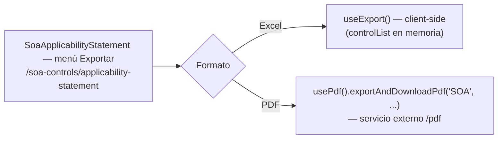

# Exportar Declaración SoA

## Propósito
Descargar la Declaración de Aplicabilidad (versión activa o una versión histórica) en un formato de archivo, para uso fuera del sistema.

## Entrada desde UI
`/soa-controls/applicability-statement` → menú de exportación, con dos opciones: **Excel** y **PDF**.

## Flujo funcional
Una sola Operación funcional ("exportar la Declaración") con dos mecanismos técnicos distintos, ninguno de los cuales usa un endpoint propio de `DOM-SOA`:

- **Excel** (`handleDownloadExcel`): 100% client-side. Usa `controlList` (ya cargado en memoria por FLOW-SOA-001/004) y lo formatea con `useExport<IControlSoa>()` — no hace ninguna llamada de red.
- **PDF** (`exportAndDownloadPdf('SOA', ...)`): delega en el servicio compartido de exportación a PDF (`usePdf`/`pdfStore`), el mismo usado por Doc-Flow y Partes Interesadas — no específico de SoA. No se documenta el endpoint/función de ese servicio aquí (dependencia externa `pdf`).

## Frontend
- `SoaApplicabilityStatement` → `handleDownloadExcel()` (Excel, client-side) / `exportAndDownloadPdf()` (PDF, `usePdf()`).

## API
No aplica — ninguna de las dos variantes llama un endpoint de `DOM-SOA`. La variante PDF llama al servicio externo `/pdf` (fuera de alcance de este módulo).

## Backend
No aplica.

## Database
No aplica.

## Reglas relevantes
- La exportación Excel usa exactamente los datos ya visibles en pantalla (`controlList`) — no refleja cambios no guardados de otra sesión ni relee la base de datos.
- La exportación PDF puede generarse tanto de la versión activa como de una versión histórica (se le pasa `analysisData.id` o el `id` de la versión consultada en FLOW-SOA-004).

## Consideraciones
- No se inventó ningún Endpoint ni Function propios de `DOM-SOA` para ninguna de las dos variantes, por instrucción explícita del diseño (Checkpoint B) — ambas quedan representadas como `clientSideOnly`/dependencia externa.
- Documentada como una sola Operación, no dos, porque ambas variantes comparten el mismo objetivo funcional ("obtener un archivo con la Declaración") y el mismo punto de entrada UI.

## Trazabilidad

