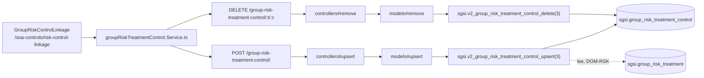

# Vincular / desvincular controles a escenarios de riesgo

## Propósito
Vincular controles del catálogo SoA a los escenarios de riesgo (por grupo de activos) que ya tienen un tratamiento definido, como evidencia de qué controles mitigan cada riesgo tratado.

## Entrada desde UI
`/soa-controls/risk-control-linkage` → listado de escenarios de riesgo con tratamiento definido → selección de un escenario → modal de selección de controles aplicables (`GroupSoAControlSelectorModal`).

## Flujo funcional
1. Al entrar, se listan los escenarios de riesgo con tratamiento definido y sus controles ya vinculados (`fetchRisks` → `EP-GROUP-RISK-TREATMENT-CONTROL-LIST-RISKS`).
2. El usuario selecciona un escenario y abre el selector de controles, que consulta los controles aplicables del catálogo SoA (`getApplicableControls` → `EP-SOA-APPLICABLE-CONTROLS`, reutilizado de SoA — mismo endpoint que usa la Operación de evaluación, sin endpoint propio de "controles aplicables para vínculo").
3. Vincular: el frontend llama `linkControlsBatch(treatmentId, controlIds)`, que internamente hace `Promise.all` de N llamadas individuales a `EP-GROUP-RISK-TREATMENT-CONTROL-UPSERT` (no existe endpoint de batch real en el backend).
4. Desvincular: `unlinkControl(treatmentId, controlId)` → `EP-GROUP-RISK-TREATMENT-CONTROL-DELETE`.

## Frontend
- `GroupRiskControlLinkage` (listado + selección de escenario) + `GroupSoAControlSelectorModal` (selector, reutiliza `useSoa().getApplicableControls`) → `useGroupRiskTreatmentControl()` → `groupRiskTreatmentControlStore`.

## API
`GET /group-risk-treatment-control/list-risks`, `POST /group-risk-treatment-control/`, `DELETE /group-risk-treatment-control/:treatmentId/:controlId` — acceso `admin-or-usuario` (sin overrides por ruta). `GET /soa/applicable-controls` — acceso `admin-or-usuario`, documentado en `DOM-SOA` bajo la Operación de evaluación, reutilizado aquí.

## Backend
`routers/groupRiskTreatmentControlRouter.ts` → `controllers/groupRiskTreatmentControl.ts` (`listRisks`, `upsert`, `remove`) → `models/groupRiskTreatmentControl.ts` (`getListRisks`, `upsert`, `remove`) → `queries/groupRiskTreatmentControl.ts`.

## Database
`sgsi.v2_group_risk_treatment_control_get_list_risks` (`funciones_sgsi.sql:18683-18731`) — lee escenarios vivos por grupo (`sgsi.v2_asset_group_threat_risk_get_scenarios`, function de `DOM-RSK`) con tratamiento definido (`sgsi.group_risk_treatment`, tabla de `DOM-RSK`) y sus controles ya vinculados (`sgsi.group_risk_treatment_control`). `sgsi.v2_group_risk_treatment_control_upsert` (variante de 3 argumentos, `:18736-18766`) valida que el tratamiento exista y pertenezca al cliente, luego hace upsert sobre `sgsi.group_risk_treatment_control`. `sgsi.v2_group_risk_treatment_control_delete` (variante de 3 argumentos, `:18634-18655`) borra el vínculo validando pertenencia del tratamiento al cliente vía `JOIN`/`USING`.

## Reglas relevantes
- `v2_group_risk_treatment_control_upsert`/`_delete` (variante de 3 args, la única alcanzable) validan `customer_id` — a diferencia del hallazgo de seguridad de `DELETE /soa/evidence/:evidenceId`, aquí sí hay aislamiento de tenant.
- El vínculo es incremental (`INSERT ... ON CONFLICT DO UPDATE`, `DELETE` puntual por par `(treatment, control)`) — no reemplaza el set completo como sí hace `sgsi.v2_group_risk_treatment_upsert` (Riesgos) al guardar el formulario de tratamiento.

## Consideraciones
- **Ownership funcional confirmado como `DOM-SOA`** (Checkpoint B, aprobado explícitamente): aunque `sgsi.group_risk_treatment_control` es una tabla física de `DOM-RSK`, la decisión de qué controles vincular y la UI que lo hace son responsabilidad de este módulo. Ver nota recíproca en `docs/00-catalog/riesgos.md` (actualizada en este mismo pase — ver diff en el reporte de Checkpoint C).
- **Riesgo de sobrescritura ya documentado del lado de Riesgos**: `sgsi.v2_group_risk_treatment_upsert` (`FLOW-RSK-010`/`FLOW-RSK-011`) reemplaza el set completo de `sgsi.group_risk_treatment_control` (`DELETE`+`INSERT`) en cada guardado del formulario de tratamiento — guardar el tratamiento desde Riesgos con un formulario desactualizado puede borrar vínculos agregados desde esta Operación.
- **"Batch" es client-side**: `linkControlsBatch` no tiene contraparte de endpoint batch real — es `Promise.all` de N llamadas a `EP-GROUP-RISK-TREATMENT-CONTROL-UPSERT` individual.
- Reutiliza `EP-SOA-APPLICABLE-CONTROLS` de la Operación de evaluación (`FLOW-SOA-001`) para el selector — no se documenta un endpoint propio de "controles aplicables para vínculo".

## Trazabilidad

