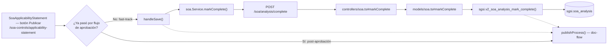

# Publicar Declaración SoA

## Propósito
Dejar la Declaración de Aplicabilidad activa como publicada/finalizada, ya sea de forma directa (fast-track) o como paso final de un proceso de aprobación documental ya completado.

## Entrada desde UI
`/soa-controls/applicability-statement` → botón **"Publicar"**, que dispara una de dos ramas según si ya existe un flujo de aprobación (`docFlow`) en estado "pendiente de publicar" o no.

## Flujo funcional
Verificado en código (`soa-applicability-statement.tsx:1259-1307`) que ambas ramas persiguen el mismo objetivo funcional (dejar la Declaración publicada) y convergen en el mismo mecanismo externo — se documentan como una sola Operación con dos ramas, no como dos Operaciones separadas:

- **Rama fast-track** (`handlePublish`, sin flujo de aprobación previo): 1) guarda el borrador pendiente (`handleSave`), 2) marca la Declaración como completa (`markSoaComplete` → `EP-SOA-ANALYSIS-COMPLETE` → `sgsi.v2_soa_analysis_mark_complete`), 3) publica en el flujo documental si existe (`publishProcess(docFlow.id)`).
- **Rama post-aprobación** (`handlePublishFromFlow`, cuando el guardado/completado ya ocurrió antes como parte del flujo de aprobación): solo llama `publishProcess(docFlow.id)` — no vuelve a guardar ni a marcar como completa.

En ambas ramas, tras publicar se refresca el estado del proceso (`getProcessByEntity('SOA', analysisId)`), la cabecera (`getSoaAnalysis`) y el historial de versiones (`getSoaVersions`).

## Frontend
- `SoaApplicabilityStatement` → `handlePublish` / `handlePublishFromFlow` → `useSoa()` (`markSoaComplete`) + `useDocFlow()` (`publishProcess`, externo).

## API
`POST /soa/analysis/complete` — acceso `admin-only`. La publicación en sí (`publishProcess`) es un endpoint del dominio externo `doc-flow`, no documentado aquí.

## Backend
`routers/soa.ts:40` → `controllers/soa.ts#markComplete` → `models/soa.ts#markComplete` → `queries/soa.ts _markComplete`.

## Database
`sgsi.v2_soa_analysis_mark_complete` (`funciones_sgsi.sql:26684-26718`): resuelve la Declaración activa (`sgsi.v2_soa_analysis_get_active`), si ya está completa retorna `success:false` sin modificar nada; si no, marca `is_complete=true`, `completed_at`, `completed_by` sobre `sgsi.soa_analysis`.

## Reglas relevantes
- Publicar dos veces la misma Declaración activa no es un error duro — `v2_soa_analysis_mark_complete` detecta el estado ya completo y responde `success:false` con mensaje, sin lanzar excepción.
- La rama post-aprobación asume (por comentario explícito en el código, `// eso ya se hizo antes`) que el guardado y el `markComplete` ya ocurrieron en un paso previo del flujo documental — no los repite.

## Consideraciones
- **Una sola Operación, dos ramas confirmadas por código** (no dos Operaciones): ambas terminan en el mismo objetivo funcional y comparten el mismo endpoint final `EP-SOA-ANALYSIS-COMPLETE` (la rama post-aprobación lo usa indirectamente, ya ejecutado en el paso anterior del flujo) más el mismo mecanismo externo `doc-flow`.
- El endpoint técnico único (`technical.endpoint: EP-SOA-ANALYSIS-COMPLETE`) representa solo la mutación propia de este dominio; `publishProcess` pertenece al dominio `doc-flow` y no se documenta aquí (ver dependencia externa).

## Trazabilidad

