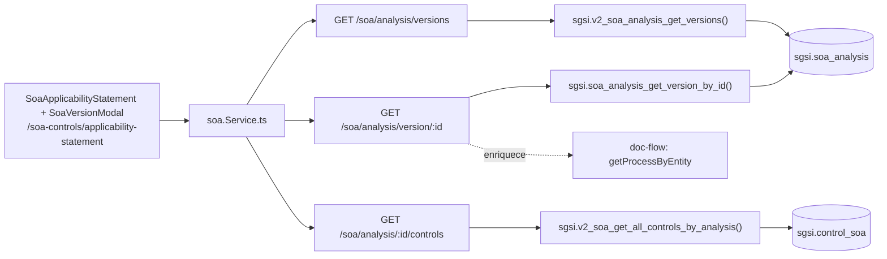

# Consultar historial / detalle de Declaración SoA

## Propósito
Consultar la cabecera de la Declaración activa, el listado de todas las versiones históricas, y el detalle completo (controles evaluados + historial de aprobación) de cualquiera de esas versiones.

## Entrada desde UI
`/soa-controls/applicability-statement` — la cabecera activa se carga siempre al entrar; el botón **"Historial de versiones"** abre `SoaVersionModal`, que lista todas las versiones y permite abrir el detalle de cualquiera.

## Flujo funcional
1. Al entrar a la pantalla, se consulta la cabecera activa (`getSoaAnalysis` → `EP-SOA-ANALYSIS-GET`).
2. Al abrir el modal de historial, se listan todas las versiones del cliente (`getSoaVersions` → `EP-SOA-ANALYSIS-VERSIONS`), ordenadas por versión descendente, con contador de controles evaluados por versión.
3. Al seleccionar una versión puntual, se consulta en paralelo su detalle (`getVersionById` → `EP-SOA-ANALYSIS-VERSION-BY-ID`) y sus controles evaluados en ese momento (`getControlsByAnalysis` → `EP-SOA-ANALYSIS-CONTROLS-BY-ID`).
4. El detalle de versión (`soa_analysis_get_version_by_id`, modelo) se enriquece en el backend con el historial de aprobación real del flujo documental (`getProcessByEntity('SOA', analysisId)`), sanitizado según el rol/participación del usuario (`sanitizeApprovalFlow`).

## Frontend
- `SoaApplicabilityStatement` (cabecera activa) + `SoaVersionModal` (listado y detalle histórico) → `useSoa()`.

## API
`GET /soa/analysis`, `GET /soa/analysis/versions`, `GET /soa/analysis/version/:id`, `GET /soa/analysis/:analysis_id/controls` — acceso `admin-or-usuario`.

## Backend
`routers/soa.ts` → `controllers/soa.ts` (`getAnalysis`, `getVersions`, `getVersionById`, `getControlsByAnalysis`) → `models/soa.ts` (mismos nombres; `getVersionById` además llama `getProcessByEntity` de `models/doc-flow.ts`) → `queries/soa.ts`.

## Database
`sgsi.soa_analysis_get_by_customer_id` (`funciones_sgsi.sql:8602-8629`), `sgsi.v2_soa_analysis_get_versions` (`:26644-26679`), `sgsi.soa_analysis_get_version_by_id` (`:8634-8664`), `sgsi.v2_soa_get_all_controls_by_analysis` (`:26849-26966`, variante de `v2_soa_get_all_controls` fijada a una versión puntual en vez de la activa).

## Reglas relevantes
- El historial de aprobación embebido en el detalle de versión se sanitiza según si el usuario es admin de sistema, tiene rol admin, y si es participante del flujo — no todos los pasos se muestran a todos los usuarios.
- `v2_soa_get_all_controls_by_analysis` no calcula `ai_suggested` para consultas históricas (`FALSE` hardcodeado, comentario explícito "Historical queries do not calculate new AI suggestions") — a diferencia de `v2_soa_get_all_controls` (versión activa), que sí lo calcula en vivo.

## Consideraciones
- Las 4 consultas de esta Operación no mutan datos — agrupadas en una sola Operación porque todas sirven al mismo objetivo funcional ("ver el estado, pasado o presente, de la Declaración") desde el mismo punto de entrada UI.
- `EP-SOA-ANALYSIS-GET` también es usado por FLOW-SOA-001/002/003 para refrescar la cabecera tras guardar/publicar/versionar — no se duplica su documentación técnica, solo se referencia por ID.

## Trazabilidad

