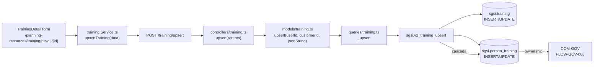

# Crear/Actualizar capacitación

## Propósito

Permitir crear una nueva capacitación o editar una existente, incluyendo su información (curso, institución, instructor, fechas, modalidad, estado) e inmediatamente asignar participantes con su estado inicial.

## Entrada desde UI

- **Nueva:** Botón «Nueva Capacitación» en `/planning-resources/training`
- **Edición:** Clic en fila de tabla → navega a `/planning-resources/training/{id}`

## Flujo funcional

1. **Carga (si existe):** Si `id != 'new'`, `TrainingDetail` busca en store o en `trainingList`
2. **Formulario:** Usuario completa:
   - `courseName` (requerido) — nombre del curso
   - `description` — descripción
   - `institution` — institución oferente
   - `instructorName` — facilitador
   - `startDate`, `endDate` — rango de fechas
   - `durationHours` — horas (numérico)
   - `modality` — presencial / online / mixta
   - `status` — planificado / en curso / finalizado / cancelado
   - `participants[]` — array de asignaciones con `{ personId, status }`
3. **Asignación de participantes:** Multi-select de personas con estado inicial (`asignado`)
4. **Envío:** `upsertTraining(data)` → `POST /training/upsert`
5. **Backend:**
   - `v2_training_upsert` recibe JSON
   - Si es NEW: genera UUID, inserta en `sgsi.training`
   - Inserta/actualiza filas en `sgsi.person_training` por cada participante
   - Si status cambia a `"en curso"` por primera vez: todos los participantes pasan a `en_curso`
   - Si status cambia a `"cancelado"`: todos los participantes pasan a `cancelado`
6. **Retorno:** Lista actualizada de capacitaciones

## Frontend

`TrainingDetail` → `useTraining()` → `trainingStore` → `training.Service.ts`.

Componente renderiza form con react-hook-form, validación Zod, modales para multi-select de participantes.

## API

- `POST /training/upsert` → `EP-TRAIN-UPSERT` (acceso: `admin-or-usuario` por router, `verifyAdminOnly` en endpoint)

Request body: JSON con estructura definida en `schemas/training.ts:upsertSchema`.

Response: array actualizado de capacitaciones o error.

## Backend

`routers/training.ts:11` → `controllers/training.ts#upsert` → `models/training.ts#upsert` → `queries/training.ts#_upsert`.

Validation: `upsertSchema.validate(body)`. Si falla, retorna `boom.badRequest`.

## Database

**Function:** `sgsi.v2_training_upsert(p_user_id uuid, p_customer_id uuid, p_json_string text) RETURNS json`

**Operaciones:**
1. Parsea JSON: lee `id` (si vacío/null = NEW), `status` (default 'planificado'), todos los campos
2. INSERT `sgsi.training` (si NEW) con `created_by`, `created_at`
3. UPDATE `sgsi.training` (si UPDATE) con `updated_by`, `updated_at`
4. Para cada participante en `participants[]`:
   - Crea/actualiza `sgsi.person_training` con `personId`, `status` inicial
5. Cascada de estados:
   - Si status = 'en curso' (primera vez): `UPDATE sgsi.person_training SET status='en_curso' WHERE training_id=?`
   - Si status = 'cancelado': `UPDATE sgsi.person_training SET status='cancelado' WHERE training_id=?`
6. Retorna lista actualizada

**Tablas tocadas:**
- `sgsi.training` (INSERT/UPDATE)
- `sgsi.person_training` (INSERT/UPDATE) — cascada de estado
- Audit: `created_by`, `updated_by`, `created_at`, `updated_at`

## Reglas relevantes

- **Asignación de participantes es parte de este UPSERT**, no operación separada
- **Transiciones de estado afectan participantes:**
  - Primera vez que training pasa a `"en curso"` → todos pasan a `en_curso`
  - Si training pasa a `"cancelado"` → todos pasan a `cancelado`
- **Soft delete:** no se ejecuta aquí (ver FLOW-TRAIN-002)
- **Validación de tenant:** controller valida `customerId` contra función
- **No hay bloqueo de workflow:** puede crearse en cualquier estado sin restricción

## Consideraciones

- **Deslinde DOM-GOV:** Los `participantPersonIds` se registran en `person_training`, pero la columna de certificado la escribe Gobierno (FLOW-GOV-008). No hay conflicto.
- **Asignación masiva:** UI soporta carga masiva via `MassiveUploadModal` + `training-massive-assign-config.ts`, pero usa el mismo endpoint `POST /upsert`
- **Evidence no es parte de este FLOW:** se adjunta después mediante endpoint `POST /:trainingId/evidence` (FLOW-TRAIN-001 solo gestiona metadata)

## Trazabilidad

