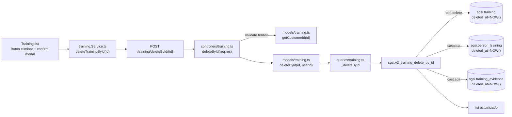

# Eliminar capacitación

## Propósito

Dar de baja una capacitación mediante soft delete, registrando el usuario que la elimina. Valida que la capacitación pertenezca al cliente autenticado antes de proceder.

## Entrada desde UI

Botón «eliminar» (icono Trash2) en:
- Fila de tabla en `/planning-resources/training`
- Modal de confirmación antes de ejecutar

## Flujo funcional

1. Usuario hace clic en icono de eliminar
2. Modal de confirmación aparece
3. Si confirma:
   - Llama `deleteTrainingById(trainingId)`
   - `POST /training/deleteById/{id}`
4. Backend:
   - Valida que training pertenezca al customer autenticado
   - Soft delete: `UPDATE sgsi.training SET deleted_at = NOW(), updated_by = userId WHERE id = ?`
   - También ejecuta cascada para `person_training` (soft delete)
5. Retorna lista actualizada o error
6. Toast de éxito

## Frontend

`Training` → `useTraining()` → `trainingStore` → `training.Service.ts`.

Componente maneja state de modal, error display, loading.

## API

- `POST /training/deleteById/{id}` → `EP-TRAIN-DELETE` (acceso: `admin-or-usuario` por router, `verifyAdminOnly` en endpoint)

Request: URL parameter `id`.

Response: array actualizado de capacitaciones o error.

## Backend

`routers/training.ts:12` → `controllers/training.ts#deleteById` → `models/training.ts#deleteById` → `queries/training.ts#_deleteById`.

Validación:
1. `idSchema.validate(params)` — valida formato UUID
2. `TrainingModel.getCustomerId(id)` — verifica propiedad
3. Si `trainingCustomerId !== customerId` → `boom.notFound`

Manejo de errores:
- `P0001` / `23503` (FK constraint) → `boom.conflict` ("No fue posible eliminar por dependencias")

## Database

**Function:** `sgsi.v2_training_delete_by_id(p_training_id uuid, p_user_id uuid) RETURNS json`

**Operaciones:**
1. Soft delete de `sgsi.training` → `UPDATE ... SET deleted_at = NOW(), updated_by = p_user_id`
2. Soft delete cascada de `sgsi.person_training` → `UPDATE ... SET deleted_at = NOW() WHERE training_id = ?`
3. Soft delete cascada de `sgsi.training_evidence` → `UPDATE ... SET deleted_at = NOW() WHERE training_id = ?`
4. Retorna lista actualizada (filtrando `deleted_at IS NULL`)

**Tablas tocadas:**
- `sgsi.training` (SOFT DELETE)
- `sgsi.person_training` (SOFT DELETE cascada)
- `sgsi.training_evidence` (SOFT DELETE cascada)

## Reglas relevantes

- **Soft delete:** nunca borra filas físicamente, marca `deleted_at`
- **Cascada:** eliminar capacitación también marca como deleted en `person_training` y evidencia
- **Auditoría:** `updated_by` registra quién hizo la eliminación
- **Validación de tenant:** mandatory, previene acceso a training de otro cliente
- **Sin restricciones de estado:** se puede eliminar en cualquier estado (planificado, en curso, etc.)

## Consideraciones

- **Governance:** eliminar `person_training` también "elimina" la asignación que Gobierno leía; es comportamiento esperado
- **Archivos físicos:** evidencia en disco no se borra en BD (soft delete); gestión de archivos es responsabilidad del garbage collection
- **Sin reintentos:** si falla FK constraint, se propaga error al usuario

## Trazabilidad

