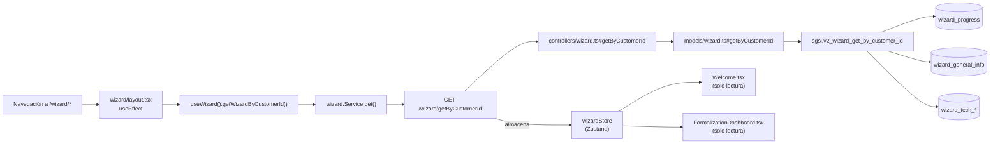

# Load & View Wizard Progress

## Propósito

Cargar el estado actual del Wizard del usuario (qué pasos completados, datos guardados, progreso general) al acceder al módulo, y mostrar ese estado en las pantallas de bienvenida, dashboard de formalización y demás vistas de lectura.

## Entrada desde UI

Automatizado: cuando el usuario navega a `/wizard/*`, el layout.tsx dispara carga automática en useEffect.

Manual: el usuario ve el progreso reflejado en `/wizard/welcome` (bienvenida con barras de progreso) y `/wizard/formalization/dashboard` (dashboard de estado).

## Flujo funcional

1. Usuario navega a `/wizard/*` (cualquier ruta dentro del módulo Wizard)
2. El layout component (`wizard/layout.tsx`) monta y ejecuta `useEffect`
3. En el useEffect, se invoca en paralelo:
   - `useWizard().getWizardByCustomerId()` — carga datos del Wizard
   - `useWizardConfig().getWizardConfig()` — carga configuración (maestros)
   - `useScope().getScopeById()` — carga contexto
   - `usePerson().getPersonListByCustomerId()` — carga personas
   - `useRol().getRolList()` — carga roles
4. Backend: GET `/wizard/getByCustomerId` → sgsi.v2_wizard_get_by_customer_id
5. Datos se almacenan en stores Zustand (`wizardStore`, `wizardConfigStore`, etc.)
6. Componentes secundarios (`Welcome`, `FormalizationDashboard`, etc.) leen datos del store (sin fetch adicional)
7. UI muestra progreso: barras de completación, pasos realizados, estadísticas

## Frontend

- `wizard/layout.tsx` → dispara carga automática en useEffect
- `useWizard().getWizardByCustomerId()` → `wizardStore` → `wizard.Service.get()`
- Componentes de lectura: `Welcome.tsx`, `FormalizationDashboard.tsx` → solo lectura del store, sin API calls nuevas

## API

`GET /wizard/getByCustomerId` — acceso `admin-or-usuario`.

## Backend

`routers/wizard.ts:1` → `controllers/wizard.ts#getByCustomerId` → `models/wizard.ts#getByCustomerId` → `queries/wizard.ts#_getByCustomerId`.

## Database

`sgsi.v2_wizard_get_by_customer_id(customer_id uuid)`:
- **READ:**
  - `sgsi.wizard_progress` (progreso actual)
  - `sgsi.wizard_general_info` (datos generales guardados)
  - `sgsi.wizard_tech_inventory` (datos técnicos)
  - `sgsi.wizard_tech_infrastructure`
  - `sgsi.wizard_identity_access`
  - `sgsi.wizard_specialized_infra`
  - `sgsi.wizard_digital_exposure`
  - `sgsi.wizard_dev_processes`
  - `sgsi.wizard_compliance`
- Retorna objeto JSONB con: `{ progress: {...}, data: {...}, generalInfo: {...}, ...}`

## Reglas relevantes

- Carga ocurre **una sola vez** al montar el layout (hasLoadedRef evita refetch innecesario)
- Si el usuario sale del Wizard (`/wizard` → otra ruta) y vuelve, se monta nuevamente → refetch
- Sin parámetros de query; el `customerId` se resuelve server-side desde la sesión autenticada
- Si el Wizard no ha iniciado (primer acceso), devuelve null/empty; UI maneja gracefully

## Consideraciones

- **Convergencia técnica:** Esta FLOW cargar datos del Wizard pero NO ejecuta ninguna operación de los dominios convergentes (Activos, Riesgos, SoA, Gobierno, Contexto). Esos datos se cargan por separado en el layout mediante otros hooks.
- **No es mutación:** GET /wizard/getByCustomerId es lectura pura. No cambia estado.
- **Carga automática vs. manual:** El trigger es automatizado (layout), pero la acción de "ver progreso" es deliberada del usuario cuando navega a las pantallas.

## Trazabilidad

