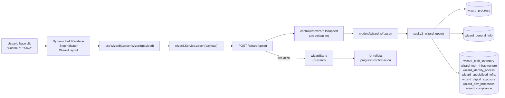

# Save Wizard Progress & Data

## Propósito

Persistir el progreso del usuario en el Wizard (pasos completados, paso actual, campos respondidos) junto con los datos técnicos/generales capturados (empresa, infraestructura, identidad, compliance, etc.). Marca completación cuando el flujo termina.

## Entrada desde UI

Botones distribuidos en múltiples componentes del Wizard:
- `DynamicFieldRenderer.tsx` — dentro de pasos con formularios dinámicos
- `StepIndicator.tsx` — navegación entre pasos
- `WizardLayout.tsx` — múltiples acciones de guardado/continuación

Disparadores: usuario hace clic en "Continue", "Save", "Complete", o el componente dispara guardado automático en puntos críticos.

## Flujo funcional

1. Usuario interactúa con formulario/campo dentro de un paso del Wizard
2. Componente construye payload con estructura:
   ```
   {
     progress: {
       currentStep: "context/scope",
       completedSteps: ["welcome"],
       answeredFields: {...},
       isCompleted: false
     },
     data: {
       generalInfo: {companyName, industry, size, ...},
       techContext: {inventory, infrastructure, ...},
       identityAccess: {...},
       digitalExposure: {...},
       compliance: {...}
     }
   }
   ```
3. Hook `useWizard().upsertWizard(payload)` invoca axios POST
4. Backend recibe POST `/wizard/upsert` → valida Joi schema
5. Controller extrae customerId y userId de sesión
6. Model → Query → DB Function: `sgsi.v2_wizard_upsert`
7. Función UPSERT:
   - Si `progress` existe: INSERT/UPDATE `wizard_progress` (currentStep, completedSteps, answeredFields, isCompleted, timestamps)
   - Si `data` existe: INSERT/UPDATE `wizard_general_info`, `wizard_tech_inventory`, `wizard_tech_infrastructure`, `wizard_identity_access`, `wizard_specialized_infra`, `wizard_digital_exposure`, `wizard_dev_processes`, `wizard_compliance`
8. Response retorna objeto JSONB actualizado
9. Store Zustand se actualiza
10. UI refleja cambios (barra de progreso, confirmación)

## Frontend

- Múltiples componentes invocan `useWizard().upsertWizard(payload)`
- `useWizard()` → `wizardStore` → `wizard.Service.upsert(payload)`

## API

`POST /wizard/upsert` — acceso `admin-only` (verifyAdminOnly).

Payload: JSON con estructura progress + data.

## Backend

`routers/wizard.ts:6` → `controllers/wizard.ts#upsert` (valida con upsertSchema Joi) → `models/wizard.ts#upsert` → `queries/wizard.ts#_upsert`.

## Database

`sgsi.v2_wizard_upsert(user_id uuid, customer_id uuid, wizard_payload jsonb)`:

**WRITE:**
- `sgsi.wizard_progress` — progreso: currentStep, completedSteps, answeredFields, isCompleted, started_by, updated_by, completed_by, started_at, updated_at, completed_at
- `sgsi.wizard_general_info` — companyName, industry, size, locations, mainActivity, criticalServices
- `sgsi.wizard_tech_inventory` — userComputers, itManagement
- `sgsi.wizard_tech_infrastructure` — onpremiseExists, onpremiseTypes, cloudExists, cloudProviders
- `sgsi.wizard_identity_access` — usuarios, roles, systemAccess
- `sgsi.wizard_specialized_infra` — virtualization, containers, cloudNative
- `sgsi.wizard_digital_exposure` — webApps, APIs, domains
- `sgsi.wizard_dev_processes` — sdlc, devops, pipelines
- `sgsi.wizard_compliance` — regulations, audits, certifications

ON CONFLICT (customer_id) DO UPDATE → actualizaciones sin duplicados.

Usa CASE WHEN para marcar `completed_by` y `completed_at` cuando `isCompleted = true`.

**Retorna:** Objeto JSONB con progreso + datos actualizados.

## Reglas relevantes

- Payload **siempre incluye ambos** progress + data; no se pueden separar
- Si alguno está ausente en el payload, se mantiene el valor previo (NULL vs. valor)
- User ID y Customer ID validados desde sesión (no permitidos en payload)
- `is_completed` marca finalización; otros campos se actualizan aunque sea false
- Soft timestamps: `started_at` no se actualiza; `updated_at` siempre; `completed_at` solo cuando se marca completo

## Consideraciones

- **Una operación, dos responsabilidades:** La función actualiza tanto progreso como datos. Esto es intencional: el Wizard es atómico — guarda ambos o ninguno.
- **No invoca otros dominios:** POST /wizard/upsert solo escribe en tablas propias del Wizard. Las operaciones de Activos, Riesgos, etc., se disparan separadamente cuando el usuario interactúa con esos componentes (ej: `/wizard/management/assets` invoca EP-ASSET-UPSERT directamente).
- **Ownership:** `dataUser(req).customerId` se usa en controller para obtener el cliente; función de BD debería validar que no se permita escribir para otro customer (REVIEW REQUIRED — ver catálogo).

## Trazabilidad


